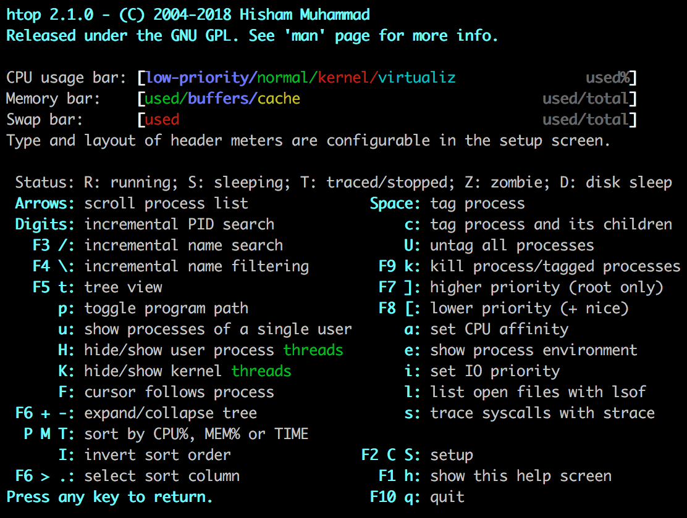

## 安装htop

```
# yum -y install ncurses-devel
# yum -y install htop
```

## F1显示



## htop使用

```
F1 : 查看htop使用说明
F2 : 设置
F3 : 搜索进程
F4 : 过滤器，按关键字搜索
F5 : 显示树形结构
F6 : 选择排序方式
F7 : 减少nice值，这样就可以提高对应进程的优先级
F8 : 增加nice值，这样可以降低对应进程的优先级
F9 : 杀掉选中的进程
F10 : 退出htop

/ : 搜索字符
h : 显示帮助
l ：显示进程打开的文件: 如果安装了lsof，按此键可以显示进程所打开的文件
u ：显示所有用户，并可以选择某一特定用户的进程
s : 将调用strace追踪进程的系统调用
t : 显示树形结构

H ：显示/隐藏用户线程
I ：倒转排序顺序
K ：显示/隐藏内核线程    
M ：按内存占用排序
P ：按CPU排序    
T ：按运行时间排序

上下键或PgUP, PgDn : 移动选中进程
左右键或Home, End : 移动列表    
Space(空格) : 标记/取消标记一个进程。命令可以作用于多个进程，例如 "kill"，将应用于所有已标记的进程
```