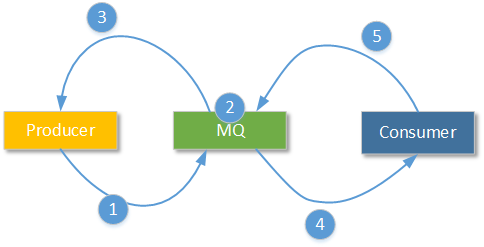
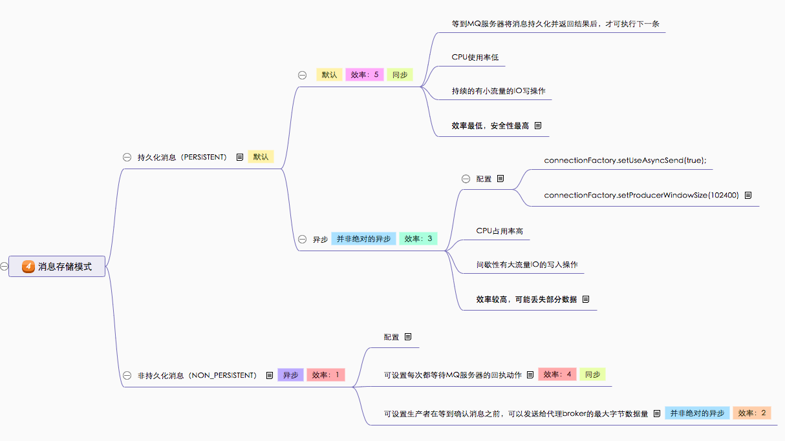
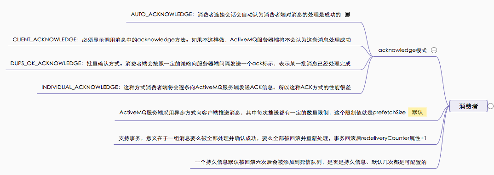

## ActiveMQ的其他命令参数

> 下载地址：https://activemq.apache.org/download-archives.html
>
> 支持协议：AMQP、MQTT、OpenWire、REST、Stomp、XMPP

**start**：于启动activemq程序

**stop**：停止当前ActiveMQ节点的运行

**restart**：重新启动当前ActiveMQ节点

**status**：查看当前ActiveMQ节点的运行状态。如果当前ActiveMQ节点没有运行，那么将返回“ActiveMQ Broker is not running”的提示信息。只能知道当前节点是否正在运行

**console**：使用控制台模式启动ActiveMQ节点；在这种模式下，开发人员可以调试、监控当前ActivieMQ节点的实时情况，并获取实时状态

**dump**：如果采用console模式运行ActiveMQ，那么就可以使用dump参数，在console控制台上获取当前ActiveMQ节点的线程状态快照

## 关键节点



1. Producer可以使用同步消息发送模式，也可以使用异步的消息发送模式
2. 消息生产者在ActiveMQ服务节点产生消息堆积的情况下可以使用 Slow Producer 保证机制
3. JMS提供事务功能，所以生产者是否开启事务发送消息，将会影响消息发送性能
4. 应对消息堆积的方式：
   - `NON_PERSISTENT Message`在内存堆积后，转储到Temp Store区域（当然也可以设置为不转储）
   - `PERSISTENT Meaage`无论怎样都会先使用持久化方案存储到永久存储区域
   - 在这些区域也产生堆积后，通知消息生产者使用Slow Producer机制
5. ActiveMQ服务节点在成功完成`PERSISTENT Meaage`的持久存储操作后，默认（可以设置成不回执）会向消息生产者发送一个确认信息，表示该条消息已处理完成。如果ActiveMQ服务节点接收的是`NON_PERSISTENT Message`，那么生产者默认情况下不会等待服务节点的回执
6. ActiveMQ服务节点主动推送消息给某一个消费者。在这个策略中，最重要的属性是prefetchSize：单次获得的消息数量
7. 消费者需要按照处理结果向ActiveMQ服务节点告知这条（或这些）消息是否处理成功——ACK应答。ActiveMQ中有多种ACK应答方式，它们对性能的影响也不相同。

### 消息发送

1. 默认情况下，ActiveMQ服务端认为生产者端发送的是`PERSISTENT Message`

2. 发送`NON_PERSISTENT Message`时，消息发送方默认使用异步方式：即是说消息发送后发送方不会等待`NON_PERSISTENT Message`在服务端的任何回执

   - **实际上所谓的异步发送也并非绝对的异步**，消息发送者会在发送一定大小的消息后等待服务端进行回执

   - 以下语句设置消息发送者在累计发送102400byte大小的消息后（可能是一条消息也可能是多条消息）。等待服务端进行回执,以便确定之前发送的消息是否被正确处理。确定服务器端是否产生了过量的消息堆积，是否需要减慢消息生产端的生产速度

     ``` java
     connectionFactory.setProducerWindowSize(102400);
     ```

   - 也可以设置成：无论怎样每次都等待服务器端的回执。但是一般不需要这么做

     ``` java
     connectionFactory.setAlwaysSyncSend(true);
     ```

3. 如果不特意指定消息的发送类型，那么消息生产者默认发送`PERSISTENT Meaage`。并且消息发送者默认等待ActiveMQ服务端对这条消息处理情况的回执

4. ActiveMQ允许开发人员遵从JMS API中的设置方式，为消息发送端在发送`PERSISTENT Meaage`时提供异步方式

   ``` java
   connectionFactory.setUseAsyncSend(true);
   
   // 一旦进行了这样的设置，就需要设置回执窗口：
   connectionFactory.setProducerWindowSize(102400);
   ```



### 事务

1. ActiveMQ支持事务。包括Topic和Queue
2. 事务开启后，生产者提交的消息都会被服务端添加到`transaction store`。在事务提交时才会将一条或多条消息放入到消息队列中去

### 生产者策略：ProducerFlowControl

> 生产流控制，设定了ActiveMQ服务节点在产生消息堆积，并超过限制大小的情况下，如何进行消息生产者端的限流

1. 策略触发时，ActiveMQ会让消息生产者进入等待状态或者在发送者端直接抛出JMSException
2. 可以配置ActiveMQ不进行ProducerFlowControl

### 消费者策略：Dispatch Async

1. 默认情况下ActiveMQ服务端采用异步方式向客户端推送消息

   > 也就是说ActiveMQ服务端在向某个消费者会话推送消息后，不会等待消费者的响应信息，直到消费者处理完消息后，主动向服务端返回处理结果

### 消费者策略：Prefetch

1. ActiveMQ系统中，默认的策略是ActiveMQ服务端一旦有消息，就主动按照设置的规则推送给当前活动的消费者。

2. 其中每次推送都有一定的数量限制，这个限制值就是prefetchSize

3. 针对Queue、Topic、`NON_PERSISTENT Message`、`PERSISTENT Message`、的队列，ActiveMQ有不同的默认“预取数量”

   ``` java
   PERSISTENT Message—Queue：prefetchSize=1000
   NON_PERSISTENT Message—Queue：prefetchSize=1000
   PERSISTENT Message—Topic：prefetchSize=100
   NON_PERSISTENT Message—Topic：prefetchSize=32766
   ```

4. 非必要情况下，不要设置prefetchSize=1，因为这样就是一条一条的取数据

5. 也不要设置为prefetchSize=0，因为这将导致关闭服务器端的推送机制，改为客户端主动请求

### 重发和死信队列

- 一条消息再被重发了多次后（默认为重发6次redeliveryCounter==6），将会被ActiveMQ移入“死信队列”
- 默认情况下“死信队列”只接受`PERSISTENT Message`，如果`NON_PERSISTENT Message`超过了重发上限，将直接被删除

### 消费者策略：ACK

- **AUTO_ACKNOWLEDGE**：这种方式下，当消费者端通过receive方法或者MessageListener监听方式从服务端得到消息后（无论是pul方式还是push方式），消费者连接会话会自动认为消费者端对消息的处理是成功的。但请注意，这种方式下消费者端不一定是向服务端一条一条ACK消息
- **CLIENT_ACKNOWLEDGE**：这种方式下，当消费者端通过receive方法或者MessageListener监听方式从服务端得到消息后（无论是pul方式还是push方式），必须显示调用消息中的acknowledge方法。如果不这样做，ActiveMQ服务器端将不会认为这条消息处理成功
- **DUPS_OK_ACKNOWLEDGE**：批量确认方式。消费者端会按照一定的策略向服务器端间隔发送一个ack标示，表示某一批消息已经处理完成。
- **INDIVIDUAL_ACKNOWLEDGE**：单条确认方式。这种方式是ActiveMQ单独提供的一种方式，其常量定义的位置都不在javax.jms.Session规范接口中，而是在org.apache.activemq.ActiveMQSession这个类中。这种方式消费者端将会逐条向ActiveMQ服务端发送ACK信息。所以这种ACK方式的性能很差，除非有特别的业务要求，否则不建议使用

### 消费者




## 总结

- 发送`NON_PERSISTENT Message`和发送`PERSISTENT Message`是有性能差异的。引起这种差异的原因是前者不需要进行持久化存储；但是这样的性能差异在某些情况下会缩小，例如发送`NON_PERSISTENT Message`时，由于消费者性能不够导致消息堆积，这时`NON_PERSISTENT Message`会被转储到物理磁盘上的“temp store”区域
- 发送带有事务的消息和发送不带有事务的消息，在服务器端的处理性能也是有显著区别的。引起这种差异的原因是带有事务的消息会首先记录在服务器端的“transaction store”区域，并且服务器端会带有redo日志，这样保证发送者端在发送commit指令或者rollback指令时，服务器会完整相应的处理
- ActiveMQ中，为消息生产者所设定的`ProducerFlowControl`策略非常重要，它确定消息在ActiveMQ服务端产生大量堆积的情况下，ActiveMQ将减缓接收消息，保证了ActiveMQ能够稳定的工作。可以通过配置文件设置`ProducerFlowControl`策略的生效阀值，甚至可以关闭`ProducerFlowControl`策略（当然不建议这样做）
- 消息生产者端和消息消费者端都可以通过“异步”方式和服务器进行通讯（但是意义不一样）。在生产者端发送异步消息，一定要和`ProducerWindowSize`（回执窗口期）的设置共同使用；在消费者异步接受消息时，要记住有`Prefetch`这个关键的预取数值，并且`PrefetchSize`在非必要情况下不要设置为1。很显然适合的`PrefetchSize`将改善服务端和消费者端的性能
- JMS规范中，消息消费者端也是支持事务的。所谓消费者端的事务是指：一组消息要么全部被commit（这时消费者会向服务端发送ACK表示），要么全部被rollback（这时同一个消费者端会向自己重发这些消息，并且这些消息的`redeliveryCounter`属性+1）；进行消息的重发是非常消耗消费者端性能的一件事情，这是因为在这个连接会话中，被Prefetch但是还没有被处理的消息将一直等待重发的消息最终被确认
- 为了避免带有错误业务信息的消息被无止境的重发，从而影响整个消息系统的性能。在ActiveMQ中为超过`MaximumRedeliveries`阀值（默认值为6，但是很明显默认值太高了，建议设置为3）的消息准备了“死信队列”
- 只有服务器收到了一条或者一组消息的ACK标示，才会认为这条或者这组消息被成功过的处理了。在消费者端有4种ACK工作模式，建议优先选择`AUTO_ACKNOWLEDGE`。如果这样做了，那么请一定重新改小预取数量、设置`OptimizeAcknowledge`为true、重设`OptimizeAcknowledgeTimeOut`时间。这样才能保证`AUTO_ACKNOWLEDGE`方式工作在“延迟确认”模式下，以便优化ACK性能


> [原文](https://blog.csdn.net/yinwenjie/article/details/50991443)