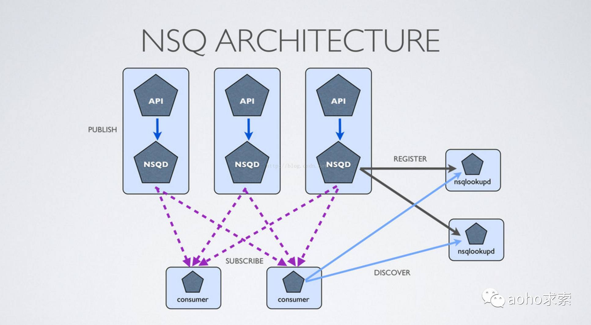
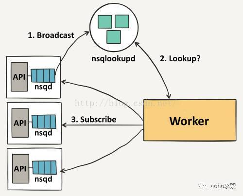

### 特点

- **Distributed**：NSQ提供了分布式的，去中心化，且没有单点故障的拓扑结构，稳定的消息传输发布保障，能够具有高容错和HA（高可用）特性
- **Scalable**：NSQ支持水平扩展，没有中心化的brokers。内置的发现服务简化了在集群中增加节点。同时支持pub-sub和load-balanced  
- **Ops Friendly**：NSQ非常容易配置和部署，生来就绑定了一个管理界面。二进制包没有运行时依赖。官方有Docker image
- **Integrated**：官方的 Go 和 Python库都有提供。而且为大多数语言提供了库

### 组件

- **Topic**：一个topic就是程序发布消息的一个逻辑键，当程序第一次发布消息时就会创建topic
- **Channels**：channel与消费者相关，是消费者之间的负载均衡，channel在某种意义上来说是一个“队列”。每当一个发布者发送一条消息到一个topic，消息会被复制到所有消费者连接的channel上，消费者通过这个特殊的channel读取消息，实际上，在消费者第一次订阅时就会创建channel。Channel会将消息进行排列，如果没有消费者读取消息，消息首先会在内存中排队，当量太大时就会被保存到磁盘中
- **Messages**：消息构成了我们数据流的中坚力量，消费者可以选择结束消息，表明它们正在被正常处理，或者重新将他们排队待到后面再进行处理。每个消息包含传递尝试的次数，当消息传递超过一定的阀值次数时，我们应该放弃这些消息，或者作为额外消息进行处理
- **nsqd**：nsqd 是一个守护进程，负责接收，排队，投递消息给客户端。它可以独立运行，不过通常它是由 nsqlookupd 实例所在集群配置的
- **nsqlookupd**：nsqlookupd 是守护进程负责管理拓扑信息。客户端通过查询 nsqlookupd 来发现指定话题（topic）的生产者，并且 nsqd 节点广播话题（topic）和通道（channel）信息。有两个接口：TCP 接口，nsqd 用它来广播。HTTP 接口，客户端用它来发现和管理
- **nsqadmin**：nsqadmin 是一套 WEB UI，用来汇集集群的实时统计，并执行不同的管理任务。 常用工具类
- **nsq_to _file**：消费指定的话题（topic）/通道（channel），并写到文件中，有选择的滚动和/或压缩文件
- **nsq_to _http**：消费指定的话题（topic）/通道（channel）和执行 HTTP requests (GET/POST) 到指定的端点
- **nsq_to_nsq**：消费者指定的话题/通道和重发布消息到目的地 nsqd 通过 TCP

### 拓扑结构

1. Nsqd节点首先会向nsqlookup广播他们的位置信息
2. 一旦它们注册成功，worker将会从nsqlookup服务器节点上发现所有包含事件topic的nsqd节点
3. 每个worker向每个nsqd主机进行订阅操作

### 消息传递

### 消息传递担保

**NSQ 保证消息将交付至少一次，消费者需要有幂等操作**

> 只有在nsqd节点异常结束时才有可能丢失消息

1. 客户表示已经准备好接收消息
2. NSQ 发送一条消息，并暂时将数据存储在本地（在 re-queue 或 timeout）
3. 客户端回复 FIN（结束）或 REQ（重新排队）分别指示成功或失败。如果客户端没有回复, NSQ 会在设定的时间超时，自动重新排队消息

