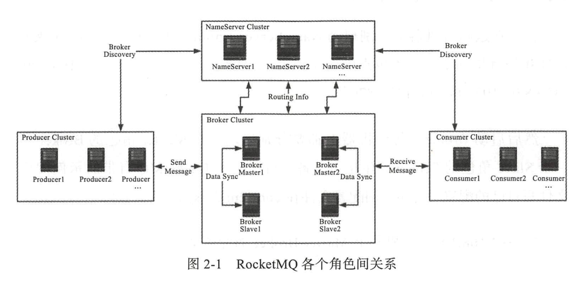

## 基本使用

```shell
启动：
  nohup ./bin/mqnamesrv &
  nohup sh ./bin/mqbroker -n 192.168.56.101:9876 -c ./conf/broker-run.properties &

关闭：
  ./bin/mqshutdown broker
  ./bin/mqshutdown namesrv
```

## 角色



### Producer

### Consumer

### Broker

### NameServer


