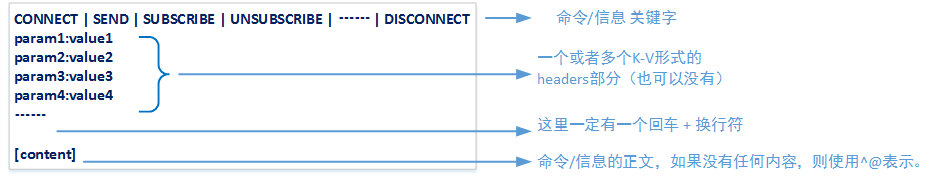
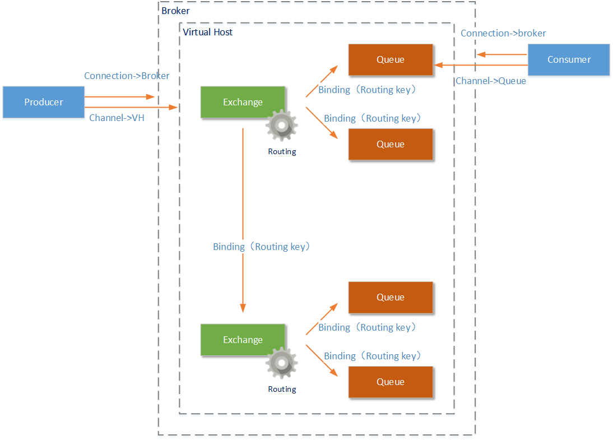
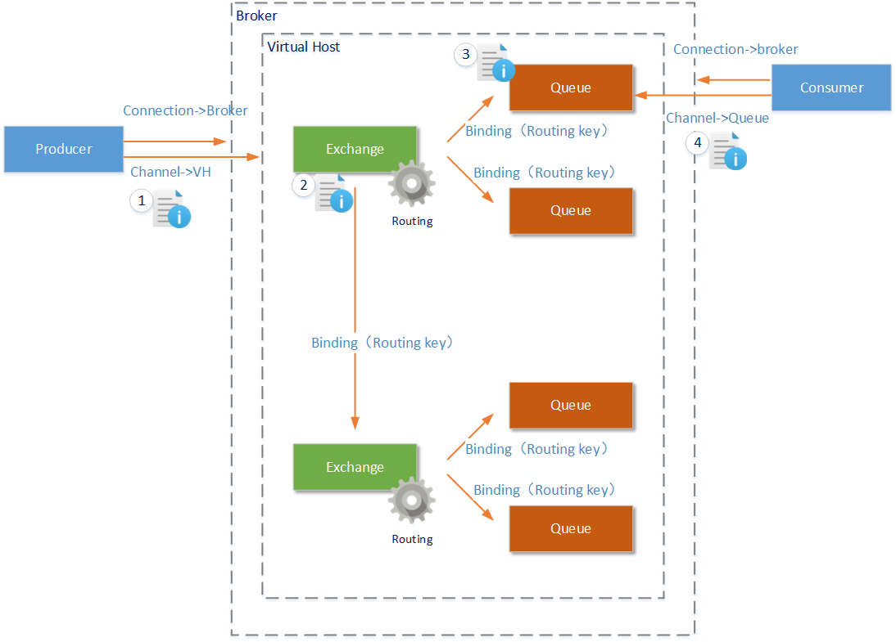

## Stomp协议

> Streaming Text Orientated Message Protocol，中文名称为 “流文本定向消息协议”。是一种以纯文本为载体的协议。

### 消息格式：



ps：

``` shell
CONNECT
accept-version:1.2
someparam1:value1
someparam2:value2

this is conntecon ^@
```

1. 它的意思为连接到Stomp代理端，并且携带了要求代理端的版本信息和两个自定义的K-V信息
2. ^@’符号，STOMP协议中用它来表示NULL

### 协议特点

1. Stomp协议中有两个重要的角色：STOMP客户端与任意STOMP消息代理（Broker）
2. 由于Stomp协议简单的原因，可以自己开发Stomp协议的client接入Stomp server（ActiveMQ）

### 协议详情

- **CONNECT/STOMP命令**：客户端通过使用CONNECT命令，连接到Stomp代理端。如果使用STOMP命令，那么Stomp代理端的版本必须是1.2

- **CONNECTED信息**：当Stomp代理端收到客户端发送来的Connect命令并且处理成功后，将向这个客户端返回CONNECTED状态信息；如果这个过程中出现任何问题，还可能返回ERROR信息

- **SEND 发送命令**：客户端使用SEND命令，向某个指定位置（代理端上的一个虚拟路径）发送内容。这样在这个路径上订阅了消息事件的其它客户端，将能够收到这个消息

- **SUBSCRIBE 订阅命令**：客户端使用SUBSCRIBE订阅命令，向Stomp服务代理订阅某一个虚拟路径上的监听。这样当其它客户端使用SEND命令发送内容到这个路径上时，这个客户端就可以收到这个消息。在使用SUBSCRIBE时，有一个重要的ACK属性。这个ACK属性说明了Stomp服务代理端发送给这个客户端的消息是否需要收到一个ACK命令，才认为这个消息处理成功了（ack的位置在K-V头中）

- **UNSUBSCRIBE 退订命令**：客户端使用这个命令，取消对某个路径上消息事件的监听。如果客户端给出的路径之前就没有被这个客户端订阅，那么这个命令执行无效

- **MESSAGE 信息**：当客户端在某个订阅的位置收到消息时，这个消息将通过MESSAGE关键字进行描述。类似以下信息就是从代理端拿到的消息描述

  ``` C
  MESSAGE
  redelivered:true
  message-id:ID:localhost-34450-1457321490460-4:24:-1:1:1
  destination:/test
  timestamp:1457331607873
  expires:0
  priority:4
  ```

- **BEGIN 开始事务命令**：Stomp协议支持事务模式，在这种模式下，使用Send命令从某个客户端发出的消息，在没有使用COMMIT正式提交前，这些消息是不会真正发送给Stomp代理端的

- **COMMIT 提交命令**：当完成事务中的信息定义后，使用该命令提交事务。**只有使用COMMIT命令后，在某一个事务中的一条或者多条消息才会进入Stomp代理端的队列**（订阅了事件的其它客户端才能收到这些消息）

- **ABORT 取消/终止事务命令**：这个命令用于取消/终止当前还没有执行COMMIT命令的事务

- **ACK 确认命令**：当客户端使用SUBSCRIBE命令进行订阅时，如果在SUBSCRIBE命令中指定ack属性为client，那么这个客户端在收到某条消息（id为XXXX）后，必须向Stomp代理端发送ACK命令，这样代理端才会认为消息处理成功了。如果Stomp客户端在断开连接之前都没有发送ACK命令，那么Stomp代理端将在这个客户端断开连接后，将这条消息发送给其它客户端

- **NACK 不确认命令**：同样是以上的SUBSCRIBE命令的状态下，如果这时Stomp客户端向Stomp代理端发送NACK信息，证明这条消息在这个客户端处理失败Stomp代理端将会把这条消息发送给另一个客户端（无论当前的客户端是否断开连接）

- **DISCONNECT 断开命令**：这个命令将断开Stomp客户端与Stomp代理端的连接

## AMQP协议

> Advanced Message Queuing Protocol（高级消息队列协议）。前AMQP协议的版本为 Version 1.0，这个协议标准在2014年通过了国际标准组织 (ISO) 和国际电工委员会 (IEC) 的投票，成为了新的 ISO 和 IEC 国际化标准

### 协议图解：



> AMQP协议中的元素包括：Message（消息体）、Producer（消息生产者）、Consumer（消息消费者）、Virtual Host（虚拟节点）、Exchange（交换机）、Queue（队列）等

- 由Producer（消息生产者）和Consumer（消息消费者）构成了AMQP的客户端，他们是发送消息和接收消息的主体。AMQP服务端称为Broker，一个Broker中一定包含完整的Virtual Host（虚拟主机）、 Exchange（交换机）、Queue（队列）定义
- 一个Broker可以创建多个Virtual Host（虚拟主机）。Exchange和Queue都是虚拟机中的工作元素（还有User元素）**注意，如果AMQP是由多个Broker构成的集群提供服务，那么一个Virtual Host也可以由多个Broker共同构成**
- Connection是由Producer（消息生产者）和Consumer（消息消费者）创建的连接，连接到Broker物理节点上。
- 但是有了Connection后客户端还不能和服务器通信，在Connection之上客户端会创建Channel，连接到Virtual Host或者Queue上。这样客户端才能向Exchange发送消息或者从Queue接受消息。**一个Connection上允许存在多个Channel，只有Channel中能够发送/接受消息**
- Exchange元素是AMQP协议中的交换机，**Exchange可以绑定多个Queue也可以同时绑定其他Exchange**。消息通过Exchange时，**会按照Exchange中设置的Routing（路由）规则，将消息发送到符合的Queue或者Exchange中**

### 消息流程图



- 在Producer（消息生产者）客户端建立了Channel后，就建立了到Broker上Virtual Host的连接。接下来Producer就可以向这个Virtual Host中的Exchange发送消息了
- Exchange（交换机）能够处理消息的前提是：**它至少已经和某个Queue或者另外的Exchange形成了绑定关系，并设置好了到这些Queue和Excahnge的Routing（路由规则）**
- Excahnge中的Routing有三种模式。在Exchange收到消息后，会根据设置的Routing（路由规则），将消息发送到符合要求的Queue或者Exchange中（路由规则还会和Message中的Routing Key属性配合使用）
- Queue收到消息后，可能会进行如下的处理：如果当前没有Consumer的Channel连接到这个Queue，那么Queue将会把这条消息进行存储直到有Channel被创建（AMQP协议的不同实现产品中，存储方式又不尽相同）；如果已经有Channel连接到这个Queue，那么消息将会按顺序被发送给这个Channel
- Consumer收到消息后，就可以进行消息的处理了。但是整个消息传递的过程还没有完成。
- Consumer在完成某一条消息的处理后，将需要手动的发送一条ACK消息给对应的Queue（可以设置为自动发送，或者无需发送）
- Queue在收到这条ACK信息后，才会认为这条消息处理成功，并将这条消息从Queue中移除。如果在对应的Channel断开后，Queue都没有这条消息的ACK信息，这条消息将会重新被发送给另外的Channel。当然，还可以发送NACK信息，这样这条消息将会立即归队，并发送给另外的Channel

