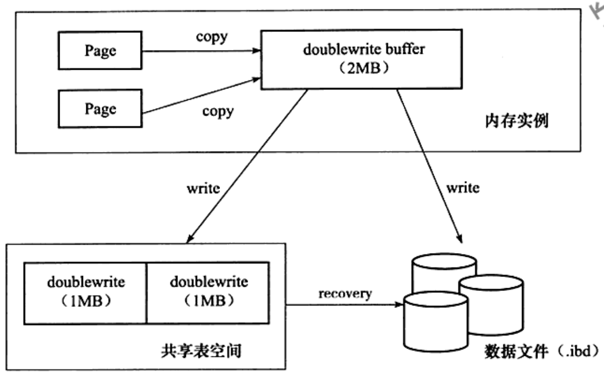
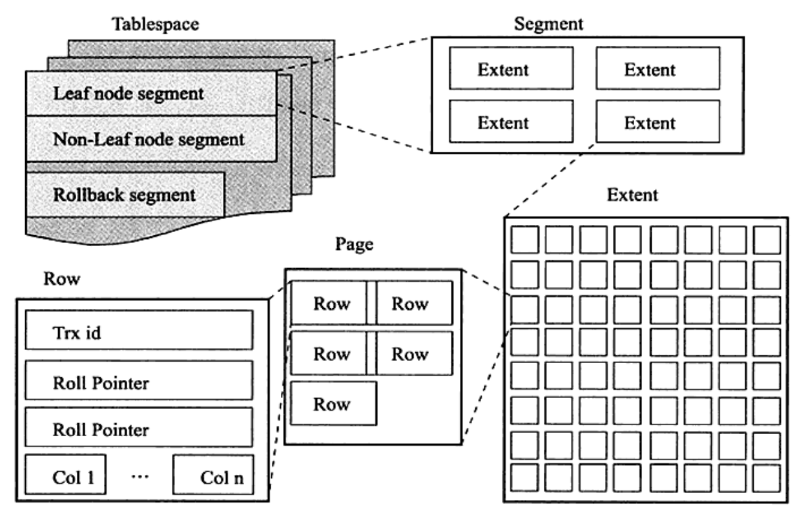

## 缓存

### 一、缓冲区（innodb_buffer_pool）

- 可以设置`innodb_buffer_pool_instances`参数配置缓冲池实例个数

- 缓冲池中页大小为16KB

- 缓冲池页淘汰使用优化后的LRU算法，优化细节：

  - 新读取到的页插入LRU列表尾端的37%位置，该位置称为`midpoint`
  - 可以使用`innodb_old_blocks_pct`这个参数控制`midpoint`大小，如果热数据过多可调小该值
  - 优化的原因在于防止类似全表扫描的全量数据操作冲掉热数据的缓冲
  - `innodb_old_blocks_time`控制加载到`midpoint`的页等待多久会晋升到LRU列表头部。默认1000ms

- 缓冲池初始化是LRU为空，空闲页全在Free列表，需要缓存时check Free列表，若有直接使用，否则LRU淘汰旧页

- 支持unzip_LRU。16KB的页可分为1K、2K、4K、8K以此满足对缓存页大小的需求

- LRU列表中的页被修改后称之为脏页，脏页也会同时也会被Flush列表关联。通过checkpoint机制将脏页刷回磁盘

  checkpoint作用：

  - 缩短数据库恢复时间
  - 缓冲池不够用时，刷新脏页到磁盘
  - 重做日志不可用时，刷新脏页

  checkpoint之前的数据已保证全部刷新到磁盘。

#### 数据页

#### 索引页

#### 插入缓冲

#### 锁信息

#### 自适应hash索引

#### 数据字典信息

### 二、重做日志缓冲（redo log_buffer）

- 可以使用`innodb_log_buffer_size`这个参数控制重做日志缓冲区大小，默认为16MB

- 重做日志缓冲刷盘时机：
  - 每秒定时刷新

  - 事务提交时刷新

    > `innodb_flush_log_at_trx_commit`控制事务提交时重做日志的方式
    >
    > - 0：不刷新redo日志到缓存
    > - 1：强制刷新redo日志到缓存【默认】
    > - 2：将redo缓存刷新到操作系统。具体刷盘时机又操作系统控制

  - 重做日志缓冲区容量小于自身最大容量的1/2时

- 事务提交时先写重做日志，再修改页。发生宕机导致页数据丢失时，通过重做日志完成数据恢复

- 可以设置多个重做日志文件组，不同组在不同的磁盘上达到HA效果

### 三、额外内存池

## 特点

### 行锁设计
### 支持外键
### 每张表单独存放在一个ibd文件中
### 按照主键顺序，采用聚集存储的方式
### MVCC（多版本并发控制）提高并发性能

- 每行记录后面保存两个隐藏的列
- 一列保存了行的创建版本号计作：A、一列保存了行的过期版本号计作：B
- 每开启一个事务，系统的版本号就会递增

**SELECT**

*必须同时符合以下两个条件才能查到该行数据*

- A列版本号要小于或者等于事务版本号
- B列版本要么未定义要么大于当前事务版本号

**INSERT**

- 新插入的一条数据保存当前事务版本号作为行版本号【A列】

**DELETE**

- 新删除的一条数据保存当前事务版本号作为行版本号【B列】

**UPDATE**

- UPDATE可以拆分为   1. DELETE  2. INSERT
- 新插入的一条数据保存当前事务版本号作为行版本号【A列】
- 新删除的一条数据保存当前事务版本号作为行版本号【B列】

### Next-key locking策略解决幻读
### 插入缓冲（Insert buffer）

- Innodb中行记录的数据插入是按照主键递增的顺序进行的，因此插入聚集索引是顺序的无需磁盘的随机访问
- 插入缓冲是为了解决在插入非唯一性的非聚集索引（辅助索引）时，由于随机访问磁盘导致性能下降的问题
- 判断非聚集索引的插入或更新操作涉及到的页是否在缓冲池中，若在直接更新，若不在新放到一个`Insert Buffer`中,之后在恰当时机再与非聚集索引页进行merge操作
- 上面的步骤也解释了为什么只有非唯一性辅助索引才能使用该功能。因为如果是唯一性索引的话还是要随机访问磁盘获取缓存内容来判断该条数据是否违反了唯一性约束的。这样就偏离了`Insert Buffer`功能的初衷

### 二次写（double write）

- `double write` 用以解决脏页写入磁盘时发生宕机出现部分写失效的问题
- 发生写失效时要先从`double write`处拿到脏页副本，恢复异常页之后根据重做日志文件内容重新写入

### 自适应hash索引（adaptive hash index）
### 预读（read ahead）

## 逻辑存储结构

### 表空间

- `innodb_file_per_table` 默认开启，开启后每张表都有自己单独的一个表空间
- 单独表空间：数据、索引、插入缓冲Bitmap   共享表空间：undo信息、插入缓冲索引、事务信息、double write buffer

### 段

- Innodb表时索引组织表，所以索引和数据在一个地方。数据段为B+数的叶子节点，索引为B+树的非叶子节点
- 包括数据段、索引段、回滚段

### 区

- `1区 = 1M = 64 * 16KB（页，默认）`

### 页

- 数据页（B-tree Node）
- undo页（undo Log Page）
- 系统页（System Page）
- 事务数据页（Transaction system Page）
- 插入缓冲位图页（Insert Buffer Bitmap）
- 插入缓冲空闲列表页（Insert Buffer Free List）
- 未压缩的二进制大对象页（Uncompressed BLOB Page）
- 压缩的二进制大对象页（compressed BLOB Page）

### 行

- 每页存放的行记录最多为  16KB / 2 - 200 = 7992 行

## 索引与算法

### B+树索引

- B+树索引不能找到给定键值的行，能找到的只能是被查找数据行所在的页。然后数据库通过把页读到内存，再从内存中使用二分查找定位到具体的行

## 事务

### 实现

- 锁实现隔离性
- redo日志实现原子性和持久性
- undo日志实现一致性，用来帮助事务回滚和MVCC操作

> redo恢复提交事务修改的页操作，undo回滚行记录到某个特定版本
>
> redo是物理日志，记录的是页的物理修改。undo是逻辑日志是行操作记录
>
> redo日志顺序写入，无特殊情况无需读取。undo日志需要随机读写