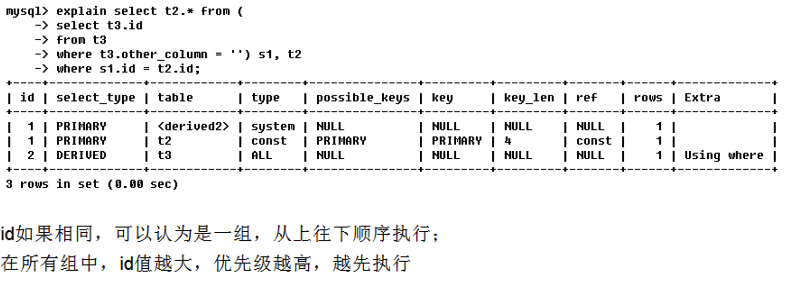

### id 列

　　从ID列可以判断SQL的执行顺序：从大到小，如果ID相同，就从上到下执行。如果行引用联合结果的其他行，那么它的值可能为NULL，这种情况下，table列的值会显示为`<unionM,N>`来指明行引用的是联合行中的带有指定`M,N`值的ID。

------

### select_type 列

- **SIMPLE**  
  简单的 `SELECT` 语句（没有使用 `union` 或者 子查询）  
- **PRIMARY**  
  最外层的 `SELECT` 语句  
- **UNION**  
  在一个 `UNION` 语句中第二或之后的SELECT语句  
- **DEPENENT_UNION**  
  在一个 `UNION` 语句中第二或之后的 `SELECT` 语句，取决于外层的查询  
- **UNION_RESULT**  
  `UNION` 的结果集  
- **SUBQUERY**  
  子查询中的第一个 `SELECT`  
- **DEPENENT_SUBQUERY**  
  子查询中的第一个 `SELECT` ,取决于外层的查询
- **DERIVED**  
  `SELECT` 的驱动表（ `FROM` 子查询）
- **MATERIALIZED**  
  物化子查询  
- **UNCACHEABLE SUBQUERY**  
  不能将结果缓存的子查询，必须重新计算外部查询的每一行  
- **UNCACHEABLE UNION**  
  在一个 `UNION` 中第二或之后的 `SELECT` 查询属于` UNCACHEABLE SUBQUERY`（请看 `UNCACHEABLE SUBQUERY` )  
- **特别声明**  
  **`DEPENDENT`**：典型代表就是使用了相关子查询。（相关子查询：子查询里包含了一个同时在子查询里，又在外部查询的表的查询）  
  **`DEPENDENT SUBQUERY`**: 它不同于 `UNCACHEABLE SUBQUERY` 的求值。对于 `DEPENDENT SUBQUERY` ，子查询对于外部上下文里每一个集合中不同的变量值仅仅重新计算一次。而对于 `UNCACHEABLE SUBQUERY`，子查询对于外部上下文里的每一行都会重新计算一次。  

------

### table 列

SQL中使用到的表。它的值也可为下面的其中之一：  

- **`<unionM,N>`**: 行引用了带有值为 `M,N` 的查询ID的联合行  
- **`<derivedN>`**: 行引用了值为 `N` 的ID的驱动表结果。例如，它是从 `FROM` 子查询中的结果形成的驱动表的结果集  

　　例：`EXPLAIN SELECT * FROM (SELECT * FROM vip_system_user) b WHERE b.id>57`  

　　　　

- **`<subqueryN>`**: 行引用了一个值为 `N` 的ID的　`materialized subquery`（物化子查询）的结果。

------

### partitions 列

查询中所匹配的记录所在的分区。这列只有在使用了 `PARTITIONS` 关键字时才会显示。对于没有使用分区表的，该值为NULL

------

### type 列

------

连接类型  

- **system**  
  表只有一行（=system table）。这个是 `const` 连接类型的一个特例。  
- **const**  
  该表最多只有一条匹配的行，这是读取查询的开始。因为这里只有一行，该行这列的值可以被优化器的剩余部分认为是常量。const表是非常快的，因为它们只会读取一次。  
  `const` 用于当你与***主键*** 或者***唯一索引***的所有部分比较的是***常量***值时。在以下的查询中，tal_name 可以被用作const表：  

　　`select * from tbl_name where primary_key = 1;`  
　　`select * from tbl_name where primary_key_part1 = 1 and primary_key_part2 = 2`

- **eq_ref**  
  从该表中读取一行与前一张表的所有行的每一种组合。除了 `system` 和 `const` 类型，这可能是最好的连接类型了。它通常于用在连接时使用了索引的所有部分，并且索引是一个***主键索引***或者***唯一非空索引***。

　　例：`EXPLAIN SELECT u.user_name FROM vip_system_user_role ur LEFT OUTER JOIN vip_system_user u ON ur.sys_user_id=u.id`  

　　　　  

- **ref**  
  所有索引匹配的行的值与前一张表的所有行的每一种组合。ref用于连接仅使用最左前缀索引或者索引不是主键索引，唯一索引（换句话说，连接不能基于该索引值选择一行 ）。如果索引用于匹配少数行，这是一个好的连接类型。`ref` 能够用于使用 `=` 或者 `<=>` 操作符的索引列中。  

　　例：`EXPLAIN SELECT * FROM vip_system_permission p1 LEFT OUTER JOIN vip_system_permission p2 ON p1.id=p2.parent_id`

　　　　  

- **fulltext**  
  这个连接使用fulltext索引执行  
- **ref_or_null**  
  这个连接类型是类似ref，但有些额外的不同：MySQL要做一些额外操作去搜索包含NULL值的行。这个连接类型通常用于优化执行子查询  
- **index_merge**  
  这个连接类型说明使用了索引合并优化。在这种情况下，在输出行的 `key` 列包含了一个使用索引的列表，并且 `key_len` 包含了使用了索引最长的那部分列表。
- **unique_subquery**  
  当子查询中查询的字段是***主键***或者***唯一性索引***时，用来在 `IN` 子查询中替代 `ref` 类型。  

　　例：`EXPLAIN SELECT * FROM vip_system_permission p1 WHERE p1.parent_id IN (SELECT id FROM vip_system_permission)`  

- **index_subquery**  
  当子查询中查询的字段是***非唯一性索引***时，用来在 `IN` 子查询中替代 `ref` 类型。  

　　例：`EXPLAIN SELECT * FROM vip_system_permission p1 WHERE p1.parent_id IN (SELECT DISTINCT parent_id FROM vip_system_permission)`  

- **range**  
  仅在给定的范围使用索引检索行。在输出的行中的 `key` 列说明使用了哪个索引。`key_len` 列包含了使用了索引的最长部分。对于这种类型下，ref列的值为NULL。  
  `range` 可以用于当索引列使用以下任一个操作符与常量比较时使用：`=, <>, >, >=, <, <=, IS NULL, <=>,BETWEEN` 或者 `IN()`  
- **index**  
  `index` 索引连接类型与 `all` 相同，除了它是扫描索引树外（即全索引扫描）。这在两种情况下发生：  

1. 如果索引对于查询来说是覆盖索引并且可用于满足要求表的数据要求，这时只有索引树会被扫描。在这种情况下，`Extra` 列会显示为 `Using index`。一个只读索引扫描通常比 `ALL` 更快，因为索引的大小通常是比表的大小更小。  
2. 全表扫描的执行是从索引读取的顺序去查找数据行。这时 `Extra` 列不会出现 `Uses index`。  

　　MySQL 当查询仅使用单独索引的一部分列时才会使用这个连接类型。  

- **ALL**  
  从前表中每一个行组合进行全表扫描。如果表是第一个表并没有标识为 `const` 的话，这通常是不好的，并且在其他的情况下是非常糟糕的。所以，你可以通过添加索引来避免ALL连接类型，这使得行检索基于常量值或者从更早的表中的列值。

### possible_keys 列

　　该列指出MySQL可以从该表中使用哪个索引去查找行。注意，该列完全独立于 `explain` 输出结果显示的表的顺序的。这意味着，一些在possible_keys里的键，在实际上可能无法在产生表的顺序时使用。  
　　如果没有相关的索引，该列就为 `NULL`。在这种情况下，你可以通过测试 `WHERE` 子句检查它使用的列有没有适当的索引来提高查询的性能。如果的确如此的话，创建一个合适的索引并使用Explain来再次检查你的查询有没有用上了索引。  
　　查看表有哪些索引，可以使用`show index from tbl_name`  

------

### key 列

　　该列指出MySQL实际决定使用的key(索引）。如果MySQL决定使用 `possible_keys` 中之一的索引去查找行，那么那个索引的值就是该key列的值  
　　不过，有可能key列的索引名没有出现在 `possible_keys` 列中。这可能发生在，如果 `possible_keys` 索引中没有一个是适合查找行的索引，但查询所选择的列都是其他索引中包含的列的情况。这意味着，命名的索引覆盖了所选择的列，所以尽管它不用于决定哪些行要检索，但一个索引扫描比数据行扫描更高效。  
　　对于InnoDB,二级索引可能覆盖了所选择的列，尽管查询也选择了主键，因为InnoDB保存每一个二级索引里保存了主键的值。如果key列为NULL，MySQL会发现没有索引可用于执行更高效的查询。  
　　强制MySQL去使用或者忽略在possible_keys列的某个索引，可以在查询中使用FORCE INDEX, USE INDEX 或者 IGNORE INDEX。  
　　对于MyISAM和NDB表，执行ANALYZE TABLE可以帮助优化器选择更好的索引。对于NDB表，这也会提高分布式下推连接的性能。对于MyISAM表，myisamchk --analyze 与 analyze table的作用相同。  

------

### key_len 列

　　该列指出MySQL决定使用的索引(key)的长度。如果key列为NULL，那么该列也为NULL。注意，key_len的值能够让你确定MySQL实际上使用了一个组合索引中的多少部分。  

------

### ref 列

　　该列显示了哪些列或常量是用于与在key列的命名的索引列来进行比较来从表中选择行的。  
　　如果值为func，该值就会用于一些函数的结果集。为了查找出哪些函数，执行SHOW WARNINGS之后，使用EXPLAIN EXTENDED来查看。函数可能实际上是一个操作符，像算术操作那样。

------

### rows 列

　　该列指出MySQL认为它必须检验执行查询的行数。  
　　对于InnoDB表，这个数值是个估计值，并不总是准确的。

------

### filtered 列

　　该列指出，表行中的百分比将会被表的条件过滤。即，rows列显示了测试的行数，而`(rows * filtered / 100)` 显示了将与之前的表进行连接的行数。该列将会在你使用 `explain extended` 时显示出来。

------

### extra 列 及常见的值

该列包含了额外的关于MySQL执行查询的信息。  

- **const row not found**  
  对于像`select ... from tbl_name`这样的查询，该表是空的。  

- **Deleting all rows**  
  对于DELETE，一些存储引擎(例如MyISAM)支持的一个处理方法简单并且快速地删除所有表行。如果引擎使用了这个优化，则Extra表的值就会显示为这个。  

- **Distinct**  
  MySQL 查找不重复的值，所以，它会停止搜索当前行之后已经第一次匹配的行。  

- **FirstMatch(tbl_name)**  
  它是用于表`tbl_name`的 semi-join FirstMatch策略的缩写  

- **Full scan on NULL key**  
  这出现在当优化器不能使用索引来优化子查询时的一个备用策略。  

- **Impossible HAVING**  
  HAVING子句总是为false并且不能检索到任何行。  

- **Impossible WHERE**  
  WHERE子句总是为false并且不能检索到任何行。  

- **Impossible WHERE noticed after reading const tables**  
  MySQL 已经读取了所有const(和system)表，并且注意到WHERE子句总是为false.  

- **LooseScan(m…n)**  
  semi-join LooseScan策略被使用。m和n是索引部分的数字。  

- **Materialize, Scan**  
  在MySQL 5.6.7 之前，这表明使用了一个独立的物化临时表。如果Scan出现，表示临时表索引没有用于读取表。否则，表示使用了索引来查找。同样也看Start materialize  
  在 MySQL 5.6.7 中，物化说明行的select_type列值为MATERIALIZED，并且行的table表是一个值为<subqueryN>  

- **No matching min/max row**  
  对于类似select min(...) from ... where condition这样的查询没有满足条件的行。  

- **no matching row in const table**  
  对于一个连接查询，有一个空表或者一个没有满足唯一索引条件的行的表。  

- **No matching rows after partition pruning**  
  对于DELETE或者UPDATE，优化器发现进行分区调整时发现没有数据可以删除或者更新。这类似于select语句的Impossible WHERE  

- **No tables used**  
  查询没有from子句，或者有一个from dual子句。  
  　　对于INSERT或者REPLACE语句，当没有select部分时explain就会显示这个值。例如， 它会出现在explain insert into t values(10)，因为它等效于explain insert into t select 10 from dual.  

- **Not exists**  
  MySQL能够在进行left join查询优化，在它发现匹配LEFT JOIN 标准一行数之后不会对于之前的行组合中在该表上检查更多的行。这有一个使用该优化的查询例子：  `select * from t1 left join t2 on t1.id = t2.id where t2.id is null`  
  　　假设t2.id是定义为NOT NULL的。在这种情况下，MySQL扫描t1并使用t1.id的值查找t2的行。如果MySQL发现在t2中有匹配的行，它知道t2.id能够永不为NULL，并且不会扫描t2中具有相同id值的剩余的行。换句话说，对于每一个t1的行，MySQL只需要在t2中进行一次查找，而不管在t2中实际有多少匹配的行。  

- **Using filesort**  
  MySQL 会对数据使用一个外部的索引排序，而不是按照表内的索引顺序进行排序。MySQL中无法利用索引完成的排序称为“文件排序”

- **Using temporary** 

  MySQL在对查询结果排序时使用到了临时表

- **Using where**  
  使用了WHERE从句来限制哪些行将与下一张表匹配或者是返回给用户。如果不想返回表中的全部行，并且连接类型ALL或index，这就会发生，或者是查询有问题  

- **Using index**  
  从表中检索的列信息只需从索引信息中获取，而不用经过额外的访问实际的表数据来寻找。覆盖索引

- **Using index condition**  
  取出索引的同时，判断是否可对where条件进行过滤。where部分过滤放在了存储引擎层

### id顺序

