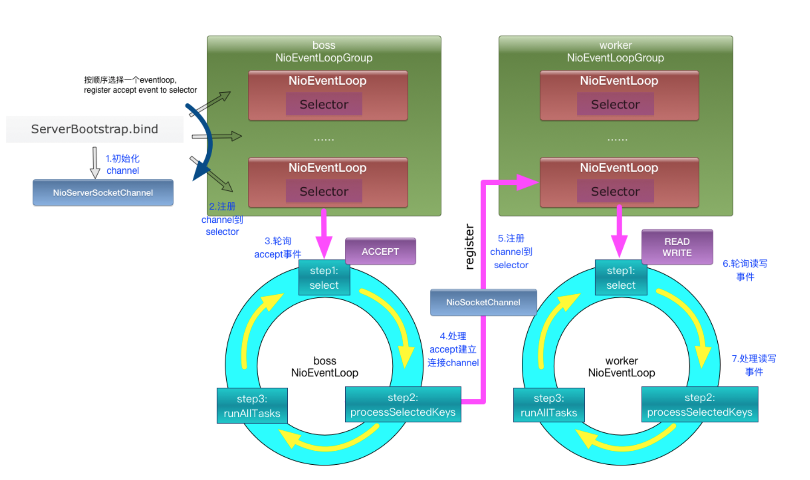

## Netty请求处理流程



## Netty Server端创建流程

### 1. 创建`ServerBootstrap`启动类 

- 使用建造者模式

### 2. 创建`EventLoopGroup`，设置并绑定Reactor线程池 

-  可以设置两个`EventLoopGroup`

```Java
DefaultThreadFactory bossFactory = new DefaultThreadFactory("JS-BOSS", false, Thread.NORM_PRIORITY);
Executor bossExecutor = new ThreadPerTaskExecutor(bossFactory);
EventLoopGroup bossGroup = new NioEventLoopGroup(1, bossExecutor);
```

``` java
DefaultThreadFactory workFactory = new DefaultThreadFactory("JS-WORK", false, Thread.NORM_PRIORITY);
Executor workExecutor = new ThreadPerTaskExecutor(workFactory);
EventLoopGroup workerGroup = new NioEventLoopGroup(NettyRuntime.availableProcessors() * 2, workExecutor);
```

### 3. 设置并绑定服务端Channel（`NioServerSocketChannel`）

- 反射实现

  ``` java
  // ReflectiveChannelFactory
  @Override
  public T newChannel() {
      try {
          return clazz.getConstructor().newInstance();
      } catch (Throwable t) {
          throw new ChannelException("Unable to create Channel from class " + clazz, t);
      }
  }
  ```

### 4. 创建并初始化`ChannelHandler` 

``` java
.handler(new ChannelInitializer<NioServerSocketChannel>() {
             @Override
             public void initChannel(NioServerSocketChannel ch) {
                 ch.pipeline().addLast(new LoggingHandler(LogLevel.INFO));
             }
         }
)
.childHandler(new ChannelInitializer<SocketChannel>() {
    @Override
    public void initChannel(SocketChannel ch) {
        ch.pipeline().addLast(Hessian2CodeFactory.buildHessian2Decoder());
        ch.pipeline().addLast(Hessian2CodeFactory.buildHessian2Encoder());
        ch.pipeline().addLast(new Hessian2ServerHandler());
    }
});
```

- 可以使用`ChannelInitializer`添加`ChannelHandler`链
- `ServerBootstrap`可以配置两个`ChannelHandler`，分别为`handler`和`childHandler`
- `handler`与`NioServerSocketChannel`对应。所有连接该监听端口的客户端都会执行它
- `childHandler`与客户端新接入连接的`SocketChannel`对应。每一个新接入的客户端都创建一个新的`childHandler`

### 5. 设置`option` 

```java
.option(ChannelOption.SO_BACKLOG, 100)
.childOption(ChannelOption.SO_BACKLOG, 100)
```

### 6. 绑定并启动监听端口

1. 调用`io.netty.bootstrap.AbstractBootstrap # initAndRegister `

   - 创建`NioServerSocketChannel`

   - 设置 channel的options、attrs参数

   - `channel.pipeline()`添加一个`ChannelInitializer`其作用如下，调用时机见`register0`：

     ```java
     public void initChannel(final Channel ch) throws Exception {
         ChannelPipeline pipeline = ch.pipeline();
         pipeline.addLast(config.handler());
         [async] pipeline.addLast(new ServerBootstrapAcceptor(
                             ch, 
                             currentChildGroup, 
                             currentChildHandler, 
                             currentChildOptions, 
                             currentChildAttrs)
         );
     }
     ```

   - BOSS线程中按顺序取出一个线程调用`register`

     ``` java
     executors[Math.abs(idx.getAndIncrement() % executors.length)].register(channel);
     ```

     1. 创建`DefaultChannelPromise`对象直接返回。用于后面添加事件监听器

        ``` java
        Promise promise = new DefaultChannelPromise(channel, eventLoop);
        promise.channel().unsafe().register(eventLoop, promise);
        return promise;
        
        ---
        
        [io.netty.bootstrap.AbstractBootstrap # doBind]
        promise.addListener(new ChannelFutureListener() {
            @Override
            public void operationComplete(ChannelFuture future) throws Exception {
                promise.registered();
                doBind0(regFuture, channel, localAddress, promise);
            }
        });
        ```

     2. 使用BOSS线程执行`register`

        ``` java
        promise.channel().unsafe().register(eventLoop, promise);
        
        ---
            
        [io.netty.channel.AbstractChannel.AbstractUnsafe # register]
        eventLoop.execute(new Runnable() {
            @Override
            public void run() {
                register0(promise);
            }
        });
        ```

2. 实际绑定注册

   >  上一步触发BOSS线程调用 `io.netty.channel.AbstractChannel.AbstractUnsafe # register0` 完成绑定

   1. `doRegister();` 注册事件监听。因为ops为0，此时无法接收客户端请求

      ```java
      selectionKey = javaChannel().register(eventLoop().unwrappedSelector(), 0, this);
      ```

   2. `pipeline.invokeHandlerAddedIfNeeded();` 执行上文中的 `initChannel` 初始化handler

      > 在调用 `invokeHandlerAddedIfNeeded()` 方法之前，pipeline中`registered`为false。此时`pipeline.addLast()` 时只是往pending handler callback队列中添加了一个任务，并未真的将handler添加到pipeline中
      >
      > 在该方法调用之后，`registered`变为true。之后`pipeline.addLast()`会直接将handler添加到pipeline中
      >
      > 注意：此时并未将`ServerBootstrapAcceptor`加入到handler队列中。添加时机在`register`方法执行完之后。因为`register`中会将`ServerBootstrapAcceptor`的添加封装成一个task提交到当前的BOSS线程队列中。

   3. `safeSetSuccess(promise);`设置注册成功标志位，触发事件监听器

      > 事件监听器是在上文6.1.1实例代码中注册的

      - `io.netty.bootstrap.AbstractBootstrap # doBind0`

      - `io.netty.channel.AbstractChannel # bind`

      - `io.netty.channel.DefaultChannelPipeline # bind`

      - 依次调用组件中的bind。pipeline -> tail -> … -> head -> unsafe

      - unsafe中有两个重要的操作

        1. ServerSocketChannel绑定IP地址及端口号

           ``` java 
           javaChannel().bind(localAddress, config.getBacklog());
           ```

        2. 使用BOSS线程执行active通知

           ``` java
           eventLoop().execute(new Runnable() {
               @Override
               public void run() {
                   pipeline.fireChannelActive();
               }
           });
           ```

      - `pipeline.fireChannelActive()`首先会触发head的`fireChannelActive()`

      - `HeadContext`中两个重要的操作。重点看`readIfIsAutoRead()`

        ``` java
        public void channelActive(ChannelHandlerContext ctx) throws Exception {
            ctx.fireChannelActive();
        
            readIfIsAutoRead();
        }
        ```

      - 判断AutoRead == true。依次调用各组件中的read。channel->pipeline->tail->...->head->unsafe

      - `io.netty.channel.nio.AbstractNioChannel # doBeginRead` ops改成为16，开始接收客户端连接

        ```Java
        protected void doBeginRead() throws Exception {
            readPending = true;
        
            final int interestOps = selectionKey.interestOps();
            if ((interestOps & readInterestOp) == 0) {
                selectionKey.interestOps(interestOps | readInterestOp);
            }
        }
        ```

   4. `pipeline.fireChannelRegistered();`

## ChannelHandler

### ChannelHandler执行顺序

#### 建立连接

#####1. channelRegistered

> 链路注册

#####2. channelActive

> 链路激活

#####3. channelRead

> 接收到请求消息

#####4. channelReadComplete

> 请求消息接收并处理完毕

#### 关闭连接

#####1. channelReadComplete
#####2. channelInactive

> 链路断开

#####3. channelUnregistered

> 取消注册

#### 出现异常

##### exceptionCaught
