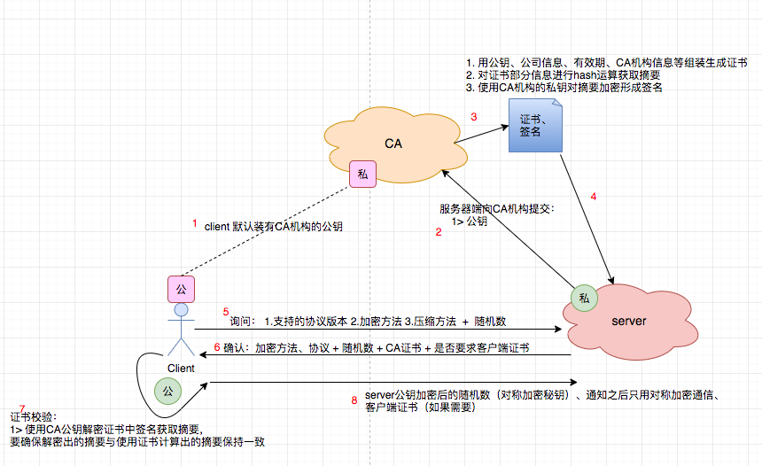

## SSL/TLS

### SSL/TLS历史关系

- 1994年，NetScape公司设计了SSL协议（Secure Sockets Layer）的1.0版，但是未发布
- 1995年，NetScape公司发布SSL 2.0版，很快发现有严重漏洞
- 1996年，SSL 3.0版问世，得到大规模应用
- 1999年，互联网标准化组织ISOC接替NetScape公司，发布了SSL的升级版[TLS](http://en.wikipedia.org/wiki/Secure_Sockets_Layer) 1.0版
- 2006年和2008年，TLS进行了两次升级，分别为TLS 1.1版和TLS 1.2版。最新的变动是2011年TLS 1.2的[修订版](http://tools.ietf.org/html/rfc6176)

http不使用SSL/TLS风险：

- **窃听风险**（eavesdropping）：第三方可以获知通信内容
- **篡改风险**（tampering）：第三方可以修改通信内容
- **冒充风险**（pretending）：第三方可以冒充他人身份参与通信

SSL/TLS要解决的问题：

- 所有信息都是**加密传播**，第三方无法窃听
- 具有**校验机制**，一旦被篡改，通信双方会立刻发现
- 配备**身份证书**，防止身份被冒充

### https流程

### 相关算法

#### 1. 摘要算法

- MD5：128位摘要
- SHA1：160位摘要

> 区别：MD5结果是128位摘要，SHa1是160位摘要。那么MD5的速度更快，而SHA1的强度更高

#### 2. 对称加密算法

- DES：被AES取代
- AES：高级加密标准，新一代标准，加密速度更快，安全性更高

#### 3.非对称加密算法

- RSA

