## 数据结构

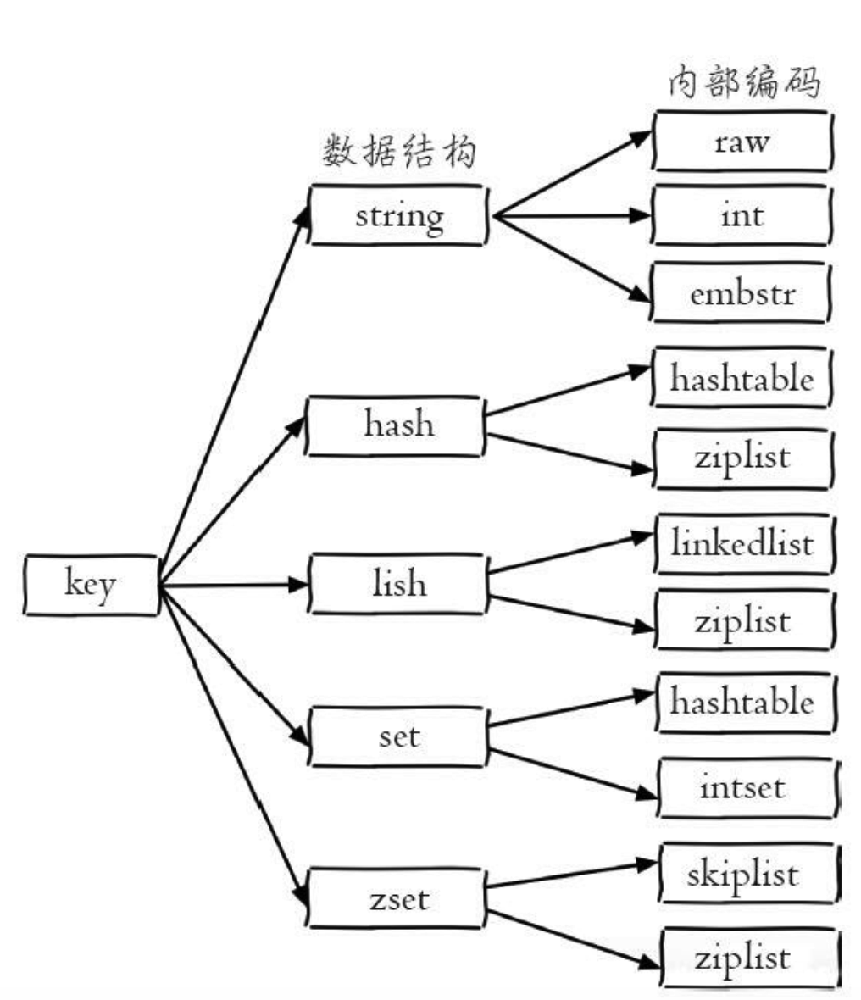

### string（ 字符串）

#### 命令

1. 设置值：`set key value [ex seconds] [px milliseconds] [nx|xx]`

   - `ex seconds`：为键设置秒级过期时间 【相同：`setex`】
   - `px milliseconds`：键设置毫秒级过期时间
   - `nx`：键必须不存在， 才可以设置成功， 用于添加【相同：`setnx`】
   - `xx`：与nx相反， 键必须存在， 才可以设置成功， 用于更新

2. 获取值：`get key`

3. 批量设置值：`mset key value [key value ...]`

4. 批量获取值：`mget key [key ...]`

5. 计数：`incr key`

   - 值不是整数， 返回错误
   - 值不是整数， 返回错误
   - 键不存在， 按照值为0自增， 返回结果为1

   > 除了incr命令， Redis提供了
   >
   > decr（自减）
   >
   >  incrby（自增指定数字）
   > decrby（自减指定数字）
   >
   > incrbyfloat（自增浮点数）

6. 追加值：`append key value`

7. 字符串长度：`strlen key`。中文占3个字节

8. 设置并返回原值：`getset key value`

9. 设置指定位置的字符：`setrange key offeset value`

10. 获取部分字符串：`getrange key start end`

#### 命令时间复杂度

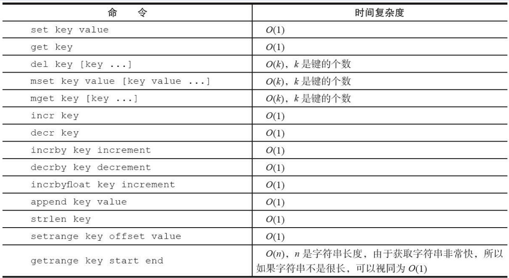

#### 内部编码

- int： 8个字节的长整型
- embstr： 小于等于39个字节的字符串
- raw： 大于39个字节的字符串

### hash（ 哈希） 

#### 命令时间复杂度

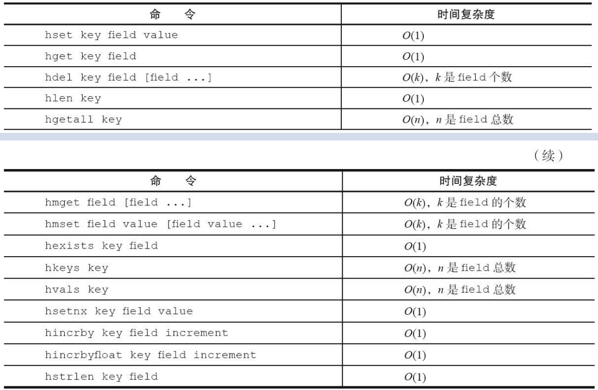

#### 内部编码

- **ziplist（ 压缩列表）** ： 当哈希类型元素个数小于`hash-max-ziplist-entries`配置（ 默认512个） 、 同时所有值都小于`hash-max-ziplist-value`配置（ 默认64字节） 时， Redis会使用ziplist作为哈希的内部实现， ziplist使用更加紧凑的结构实现多个元素的连续存储， 所以在节省内存方面比hashtable更加优秀
- **hashtable（ 哈希表）** ：当哈希类型无法满足ziplist的条件时， Redis会使用hashtable作为哈希的内部实现， 因为此时ziplist的读写效率会下降， 而hashtable的读写时间复杂度为O（ 1） 

### list（ 列表） 

#### 命令时间复杂度

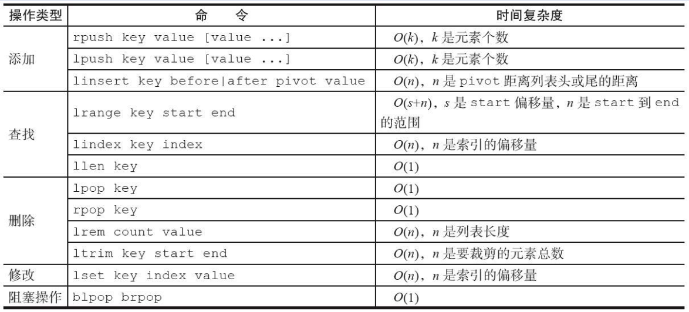

#### 内部编码

- **ziplist（ 压缩列表）** ： 当列表的元素个数小于`list-max-ziplist-entries`配置（ 默认512个） ， 同时列表中每个元素的值都小于`list-max-ziplist-value`配置时（ 默认64字节） ， Redis会选用ziplist来作为列表的内部实现来减少内存的使用。
- **linkedlist（ 链表）** ： 当列表类型无法满足ziplist的条件时， Redis会使用linkedlist作为列表的内部实现
- **quicklist**：Redis3.2版本提供了quicklist内部编码， 简单地说它是以一个ziplist为节点的linkedlist， 它结合了ziplist和linkedlist两者的优势， 为列表类型提供了一种更为优秀的内部编码实现

### set（ 集合） 

#### 命令时间复杂度

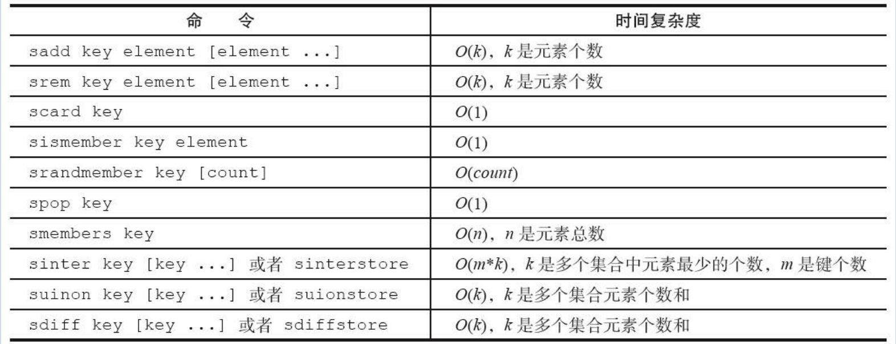

#### 内部编码

- **intset（ 整数集合）** ： 当集合中的元素都是整数且元素个数小于`set-maxintset-entries`配置（ 默认512个） 时， Redis会选用intset来作为集合的内部实现， 从而减少内存的使用
- **hashtable（ 哈希表）** ： 当集合类型无法满足intset的条件时， Redis会使用hashtable作为集合的内部实现

### zset（ 有序集合） 

#### 命令时间复杂度

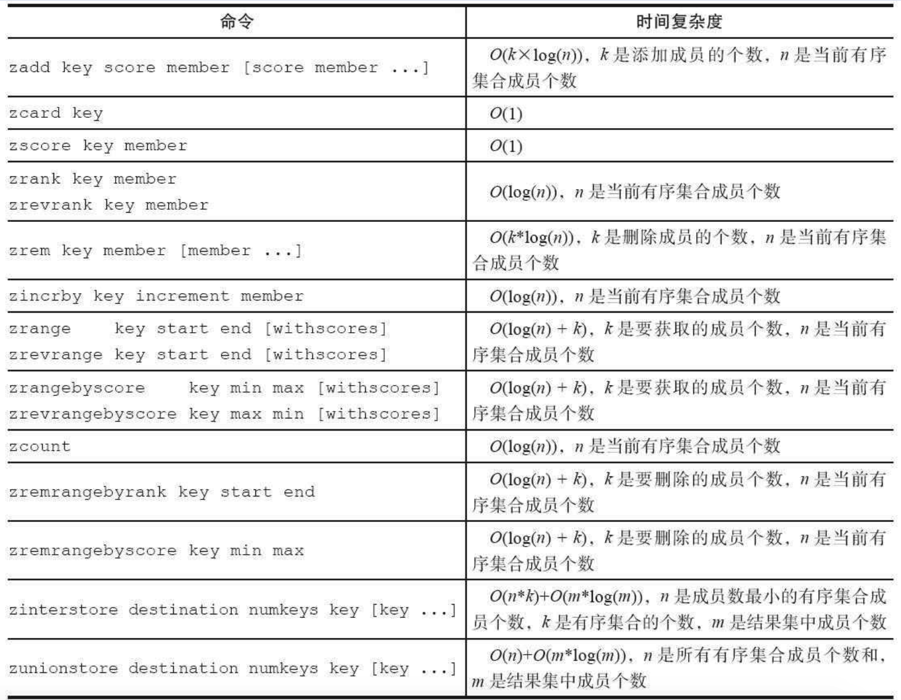

#### 内部编码

- **ziplist（ 压缩列表）** ： 当有序集合的元素个数小于`zset-max-ziplistentries`配置（ 默认128个） ， 同时每个元素的值都小于`zset-max-ziplist-value`配置（ 默认64字节） 时， Redis会用ziplist来作为有序集合的内部实现， ziplist可以有效减少内存的使用
- **skiplist（ 跳跃表）** ： 当ziplist条件不满足时， 有序集合会使用skiplist作为内部实现， 因为此时ziplist的读写效率会下降

> ### Bitmaps（ 位图）
>
> ### HyperLogLog
>
> ### GEO（ 地理信息定位）


## 命令

### 全局命令

- 查看全部键：`keys *`
- 键总数：`dbsize`。直接获取已经保存的键总数，时间复杂度O（1）
- 键是否存在：`exists key`
- 删除键：`del key`。删除成功返回删除的个数，删除的键不存在返回0
- 键过期：`expire key seconds`
- 查看键过期时间：`ttl`。大于等于0：代表未过期。-1：键没设置过期时间。-2：键不存在
- 键数据结构类型：`type key`
- 查看内部编码：`object encoding key` 
- 键重命名：`rename key newkey`
- 随机返回一个键：`randomkey`
- 夸库迁移：`migrate`
- 遍历key：`scan cursor [match pattern] [count number]`
  - **cursor**：是必需参数， 实际上cursor是一个游标， 第一次遍历从0开始， 每次scan遍历完都会返回当前游标的值， 直到游标值为0， 表示遍历结束
  - **match pattern**：是可选参数， 它的作用的是做模式的匹配， 这点和keys的模式匹配很像
  - **count number**：是可选参数， 它的作用是表明每次要遍历的键个数， 默认值是10， 此参数可以适当增大
- 删除 当前/全部 库的数据：`flushdb/flushall`

### 慢查询

1. `slowlog-log-slower-than`。单位微秒（ 1秒=1000毫秒=1000000微秒）。默认值10000
   - x > 0 记录超过阈值的命令。只统计命令的执行时间不会统计命令的排队时间
   - x = 0 记录所有的命令
   - x < 0 任何命令都不会进行记录
2. `slowlog-max-len`。保存慢查命令队列的长度。先进先出

``` shell
config set slowlog-log-slower-than 20000
config set slowlog-max-len 1000
# 将配置信息持久化存储
config rewrite
```

3. 获取慢查询日志`slowlog get [n]`

   ```Shell
   slowlog get
   1) 
   	1) (integer) 666 # 标识id
   	2) (integer) 1456786500 # 发生时间戳
   	3) (integer) 11615 # 命令耗时
   	4) # 执行命令和参数
   		1) "BGREWRITEAOF"
   2) 
   	1) (integer) 665
   	2) (integer) 1456718400
   	3) (integer) 12006
   	4)
   		1) "SETEX"
   		2) "video_info_200"
   		3) "300"
   		4) "2"
   ```

4. 获取慢查询队列长度`slowlog len`

5. 慢查询日志重置`slowlog reset`

### shell使用

#### redis-cli

- **-r（ repeat）**：代表将命令执行多次， 例如下面操作将会执行三次ping

  ```shell
  $ redis-cli -r 3 ping
  PONG
  PONG
  PONG
  ```

- **-i（interval）**：代表每隔几秒执行一次命令， 但是-i选项必须和-r选项一起使用

  ```shell
  $ redis-cli -r 5 -i 1 ping
  PONG
  PONG
  PONG
  PONG
  PONG
  ```

- **-x**：代表从标准输入（ stdin） 读取数据作为redis-cli的最后一个参数

  ``` shell
  $ echo "world" | redis-cli -x set hello
  ```

- **-c（ cluster）**:连接Redis Cluster节点时需要使用的， -c选项可以防止moved和ask异常

- **-a**：如果Redis配置了密码， 可以用-a（ auth） 选项， 有了这个选项就不需要手动输入auth命令

- **--scan和--pattern**：用于扫描指定模式的键， 相当于使用scan命

- **--slave**：把当前客户端模拟成当前Redis节点的从节点， 可以用来获取当前Redis节点的更新操作

- **--rdb**：会请求Redis实例生成并发送RDB持久化文件， 保存在本地

- **--pipe**：用于将命令封装成Redis通信协议定义的数据格式， 批量发送给Redis执行

- **--bigkeys**：使用scan命令对Redis的键进行采样， 从中找到内存占用比较大的键值， 这些键可能是系统的瓶颈

- **--eval**：用于执行指定Lua脚本

- **--latency**：有三个选项， 分别是--latency、 --latency-history、 --latency-dist。可以检测网络延迟

- **--stat**：可以实时获取Redis的重要统计信息

- **--raw和--no-raw**：要求命令的返回结果必须是原始的格式(--raw)

#### redis-server

- 检测当前操作系统能否提供1G的内存给Redis`redis-server --test-memory 1024`
- 启动：`./redis-server ../redis.conf`

#### redis-benchmark

> redis-benchmark-c100-n20000代表100各个客户端同时请求Redis

### 客户端连接池参数

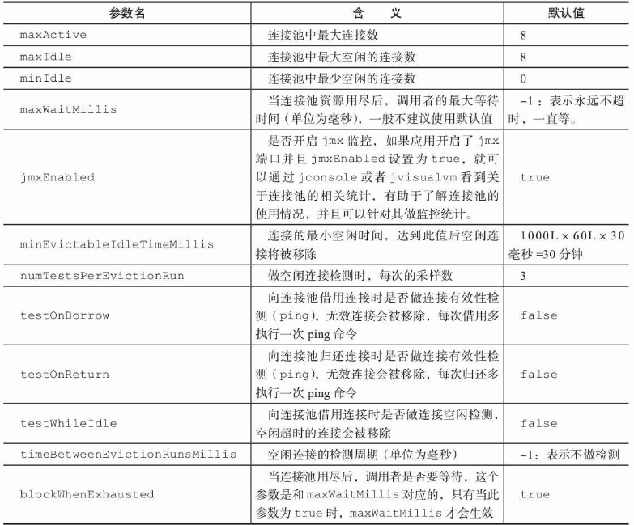

### 客户端管理

- **列出与Redis服务端相连的所有客户端连接信息**

  ``` shell
  > client list
  id=15 addr=192.168.56.101:43568 fd=5 name= age=5 idle=0 flags=N db=0 sub=0 psub=0 multi=-1 qbuf=0 qbuf-free=32768 obl=0 oll=0 omem=0 events=r cmd=client
  ```

  - **id**：客户端连接的唯一标识， 这个id是随着Redis的连接自增的， 重启Redis后会重置为0

  - **addr**：客户端连接的ip和端口

  - **fd**：socket的文件描述符， 与lsof命令结果中的fd是同一个， 如果fd=-1代表当前客户端不是外部客户端， 而是Redis内部的伪装客户端

  - **name**：客户端的名字

  - **qbuf、 qbuf-free**：分别代表当前客户端命令缓冲区的总容量和剩余容量。这个不可配置redis动态调整。当缓冲区超过1GB时，客户端会被关闭。输入缓冲区不受maxmemory控制

    > 可以使用`info clients`查看当前客户端的一个现状
    >
    > ``` shell
    > > info clients
    > # Clients
    > connected_clients:1 # 当前Redis节点的客户端连接数
    > client_longest_output_list:0 # 当前所有输出缓冲区中队列对象个数的最大值
    > client_biggest_input_buf:0 # 当前所有输入缓冲区中占用的最大容量
    > blocked_clients:0 # 正在执行阻塞命令（ 例如blpop、 brpop、brpoplpush） 的客户端个数
    > ```

  - **obl、 oll、 omem**：obl代表固定缓冲区的长度（对象个数）。oll代表动态缓冲区列表的长度（对象个数）， omem代表使用的字节数

    > ​	输出缓冲区的容量可以通过参数 `client-output-buffer-limit` 来进行设置。按照客户端的不同分为三种： 普通客户端、 发布订阅客户端、 slave客户端。输出缓冲区也不会受到maxmemory的限制。
    >
    > ​	输出缓冲区由两部分组成： 固定缓冲区（ 16KB） 和动态缓冲区， 其中固定缓冲区返回比较小的执行结果， 而动态缓冲区返回比较大的结果。固定缓冲区使用的是字节数组， 动态缓冲区使用的是列表。 当固定缓冲区存满后会将Redis新的返回结果存放在动态缓冲区的队列中， 队列中的每个对象就是每个返回结果。

    > ```shell
    > client-output-buffer-limit <class> <hard limit> <soft limit> <soft seconds>
    > 
    > 	- <class>： 客户端类型， 分为三种。 a） normal： 普通客户端； b）slave： slave客户端， 用于复制； c） pubsub： 发布订阅客户端
    > 	- <hard limit>： 如果客户端使用的输出缓冲区大于<hard limit>， 客户端会被立即关闭
    > 	- <soft limit>和<soft seconds>： 如果客户端使用的输出缓冲区超过了<soft limit>并且持续了<soft limit>秒， 客户端会被立即关闭
    > 
    > redis默认配置：
    > 
    > client-output-buffer-limit normal 0 0 0
    > client-output-buffer-limit slave 256mb 64mb 60
    > client-output-buffer-limit pubsub 32mb 8mb 60
    > ```

    > 可以适当增大slave的输出缓冲区的， 如果master节点写入较大， slave客户端的输出缓冲区可能会比较大， 一旦slave客户端连接因为输出缓冲区溢出被kill， 会造成复制重连。

  - **age、idle**：分别代表当前客户端已经连接的时间（单位s）和最近一次的空闲时间。当age等于idle时，说明连接一直处于空闲状态

  - **flag**：用于标识当前客户端的类型

    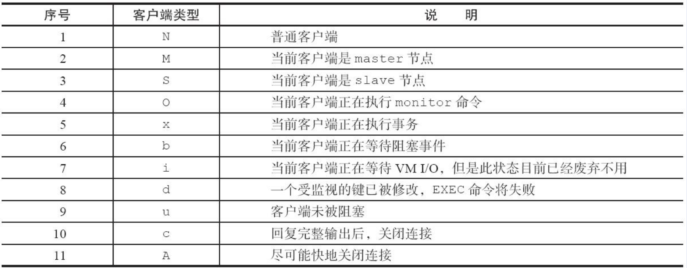

  - **multi**：当前事务中已执行命令个数

  - **events**：文件描述符事件。r和w分别代表客户端套接字刻可读、可写

  - **cmd**：当前客户端最后一次执行的命令，不包含参数

- **客户端的限制maxclients和timeout**

  1. 一旦连接数超过maxclients， 新的连接将被拒绝。 maxclients默认值是10000。可以通过`info clients`来查询当前Redis的连接数
  2. 一旦客户端连接的idle时间超过了timeout连接将会被关闭。默认是0不进行检测
  3. 可以通过 `config set maxclients` 对最大客户端连接数进行动态设置

- **client setName、client getName**

- **client kill**：杀掉指定IP地址和端口的客户端

  ``` shell
  client kill 192.168.56.101:43568
  ```

- **client pause**：用于阻塞客户端timeout毫秒数， 在此期间客户端连接将被阻塞

  ``` shell
  client pause timeout(毫秒)
  ```

- **monitor**：监控Redis正在执行的命令

- **tcp-keepalive**：检测TCP连接活性的周期， 默认值为0， 也就是不进行检测， 如果需要设置， 建议为60， 那么Redis会每隔60秒对它创建的TCP连接进行活性检测， 防止大量死连接占用系统资源。

- **tcp-backlog**：TCP三次握手后， 会将接受的连接放入队列中， tcp-backlog就是队列的大小， 它在Redis中的默认值是511。在Linux系统中如果/proc/sys/net/core/somaxconn小于tcp-backlog， 那么在Redis启动时会有warn日志，并建议调整Linux配置

- **info stats**：

  ```shell
  > info stats
  # Stats
  total_connections_received:17  # Redis自启动以来处理的客户端连接数总数
  total_commands_processed:422
  instantaneous_ops_per_sec:0
  total_net_input_bytes:10026
  total_net_output_bytes:48891171
  instantaneous_input_kbps:0.00
  instantaneous_output_kbps:0.00
  rejected_connections:0  # Redis自启动以来拒绝的客户端连接数， 需要重点监控
  sync_full:0
  sync_partial_ok:0
  sync_partial_err:0
  expired_keys:0
  evicted_keys:0
  keyspace_hits:23
  keyspace_misses:3
  pubsub_channels:0
  pubsub_patterns:0
  latest_fork_usec:4031
  migrate_cached_sockets:0
  ```

## 持久化

### RDB

> RDB持久化是把当前进程数据生成快照保存到硬盘的过程， 触发RDB持久化过程分为手动触发和自动触发

#### 触发RDB持久化的时机

- **save**：阻塞当前Redis服务器， 直到RDB过程完成为止， 对于内存比较大的实例会造成长时间阻塞（已废弃）
- **bgsave**：Redis进程执行fork操作创建子进程， RDB持久化过程由子进程负责， 完成后自动结束。 阻塞只发生在fork阶段， 一般时间很短
- **save m n**：表示m秒内数据集存在n次修改时， 自动触发bgsave
- 如果从节点执行全量复制操作， 主节点自动执行bgsave生成RDB文件并发送给从节点
- 执行debug reload命令重新加载Redis时，会自动触发save操作
- 默认情况下执行shutdown命令时， 如果没有开启AOF持久化功能则自动执行bgsave

#### bgsave命令的运作流程

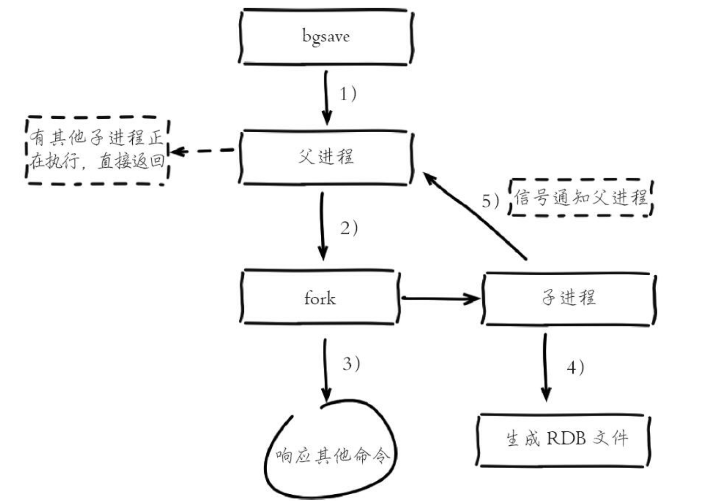

1. 执行bgsave命令， Redis父进程判断当前是否存在正在执行的子进程， 如RDB/AOF子进程， 如果存在bgsave命令直接返回
2. 父进程执行fork操作创建子进程， fork操作过程中父进程会阻塞， 通过info stats命令查看latest_fork_usec选项， 可以获取最近一个fork操作的耗时， 单位为微秒。
3. 父进程fork完成后， bgsave命令返回“Background saving started”信息并不再阻塞父进程， 可以继续响应其他命令
4. 子进程创建RDB文件， 根据父进程内存生成临时快照文件， 完成后对原有文件进行原子替换。 执行lastsave命令可以获取最后一次生成RDB的时间， 对应info统计的rdb_last_save_time选项
5. 进程发送信号给父进程表示完成， 父进程更新统计信息
6. RDB文件保存在dir配置指定的目录下， 文件名通过dbfilename配置
7. Redis默认采用LZF算法对生成的RDB文件做压缩处理， 压缩后的文件远远小于内存大小， 默认开启， 可以通过参数`config set rdbcompression{yes|no}`动态修改

#### 优缺点

##### 优点：

1. RDB是一个紧凑压缩的二进制文件， 代表Redis在某个时间点上的数据快照。 非常适用于备份， 全量复制等场景
2. Redis加载RDB恢复数据远远快于AOF的方式

##### 缺点：

1. RDB方式数据没办法做到实时持久化/秒级持久化。 因为bgsave每次运行都要执行fork操作创建子进程， 属于重量级操作， 频繁执行成本过高
2. RDB文件使用特定二进制格式保存，存在兼容性问题

### AOF（ append only file）

> 以独立日志的方式记录每次写命令，重启时再重新执行AOF文件中的命令达到恢复数据的目的。 AOF的主要作用是解决了数据持久化的实时性， 目前已经是Redis持久化的主流方式。
>
> 开启AOF功能需要设置配置： appendonly yes， 默认不开启。AOF文件名通过appendfilename配置设置， 默认文件名是appendonly.aof。保存路径同RDB持久化方式一致。

#### 流程

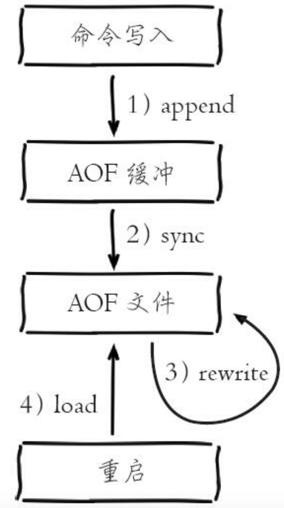

1. 流程：命令写入（ append） 、 文件同步（ sync） 、 文件重写（ rewrite） 、 重启加载（ load）
2. 所有的写入命令会追加到aof_buf（ 缓冲区） 中
3. AOF缓冲区根据对应的策略向硬盘做同步操作
4. 随着AOF文件越来越大， 需要定期对AOF文件进行重写， 达到压缩的目的
5. 当Redis服务器重启时， 可以加载AOF文件进行数据恢复

#### 命令写入

- AOF直接采用文本协议

#### 文件同步

- AOF缓冲区同步文件策略

  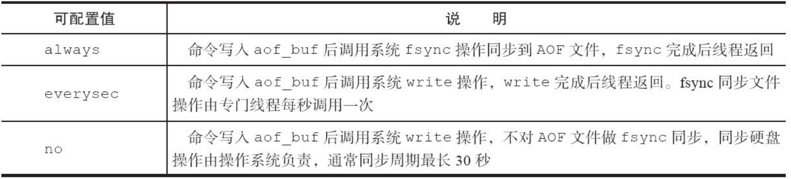

> write操作会触发延迟写（ delayed write） 机制。 Linux在内核提供页缓冲区用来提高硬盘IO性能。 write操作在写入系统缓冲区后直接返回。 同步硬盘操作依赖于系统调度机制， 例如： 缓冲区页空间写满或达到特定时间周期。 同步文件之前， 如果此时系统故障宕机， 缓冲区内数据将丢失
>
> fsync针对单个文件操作（ 比如AOF文件） ， 做强制硬盘同步， fsync将阻塞直到写入硬盘完成后返回， 保证了数据持久化

#### 重写机制

> AOF重写降低了文件占用空间， 除此之外， 另一个目的是： 更小的AOF文件可以更快地被Redis加载。

- **手动触发**： 直接调用bgrewriteaof命令

- **自动触发**： 根据auto-aof-rewrite-min-size和auto-aof-rewrite-percentage参数确定自动触发时机

  > auto-aof-rewrite-min-size： 表示运行AOF重写时文件最小体积， 默认为64MB
  >
  > auto-aof-rewrite-percentage： 代表当前AOF文件空间（ aof_current_size） 和上一次重写后AOF文件空间（ aof_base_size） 的比值
  >
  > 自动触发时机=aof_current_size>auto-aof-rewrite-minsize&&（ aof_current_size-aof_base_size）/aof_base_size>=auto-aof-rewritepercentage
  >
  > 其中aof_current_size和aof_base_size可以在info Persistence统计信息中查看

- **AOF重写流程**

  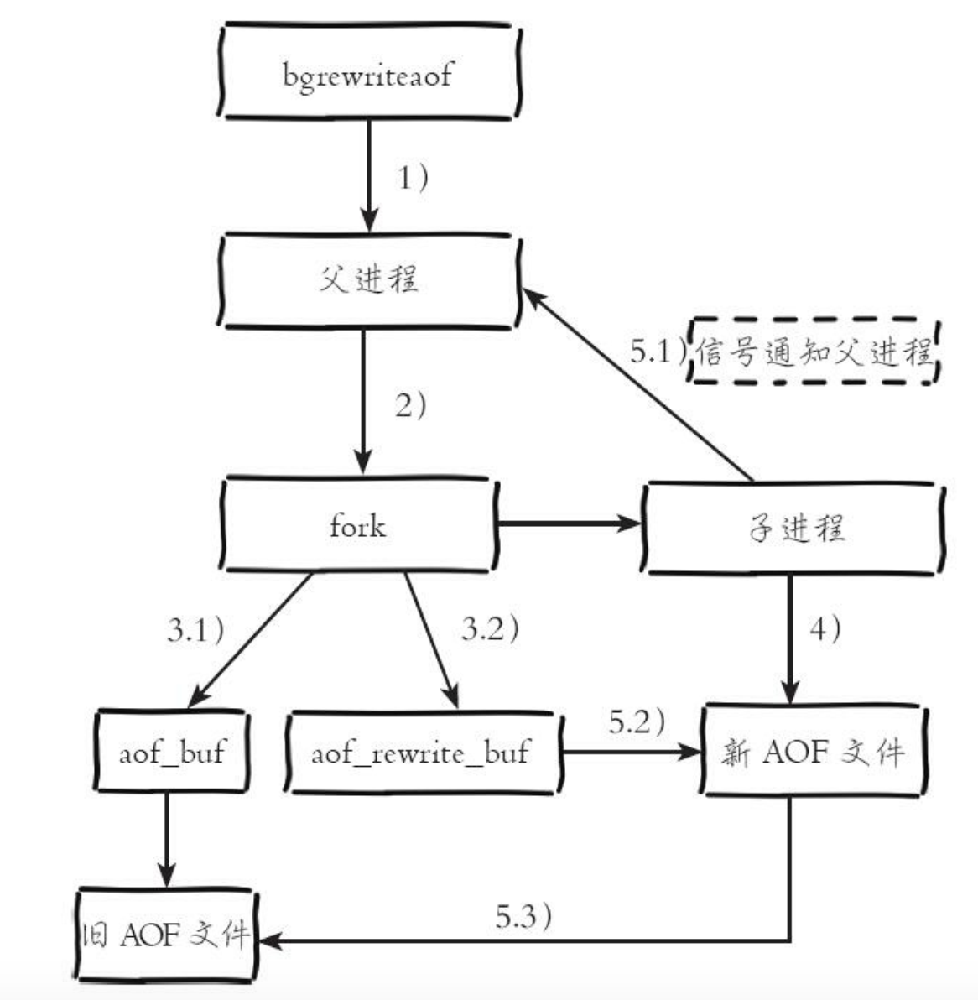

  1. 执行AOF重写请求，如果当前进程正在执行AOF重写， 请求不执行并返回
  2. 如果当前进程正在执行bgsave操作， 重写命令延迟到bgsave完成之后再执行
  3. 父进程执行fork创建子进程， 开销等同于bgsave过程
  4. 主进程fork操作完成后， 继续响应其他命令。 所有修改命令依然写入AOF缓冲区并根据appendfsync策略同步到硬盘， 保证原有AOF机制正确性
  5. 由于fork操作运用写时复制技术， 子进程只能共享fork操作时的内存数据。 由于父进程依然响应命令， Redis使用“AOF重写缓冲区”保存这部分新数据， 防止新AOF文件生成期间丢失这部分数据
  6. 子进程根据内存快照， 按照命令合并规则写入到新的AOF文件。 每次批量写入硬盘数据量由配置aof-rewrite-incremental-fsync控制， 默认为32MB， 防止单次刷盘数据过多造成硬盘阻塞
  7. 新AOF文件写入完成后， 子进程发送信号给父进程， 父进程更新统计信息， 具体见info persistence下的aof_*相关统计
  8. 父进程把AOF重写缓冲区的数据写入到新的AOF文件
  9. 使用新AOF文件替换老文件， 完成AOF重写


#### 重启加载

  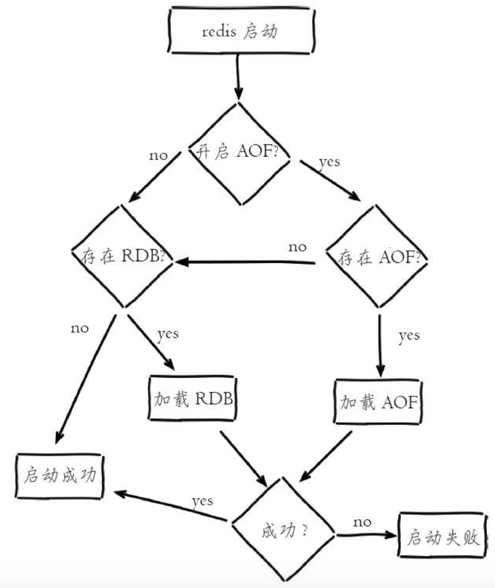

  1. AOF持久化开启且存在AOF文件时， 优先加载AOF文件
  2. AOF关闭或者AOF文件不存在时， 加载RDB文件
  3. 加载AOF/RDB文件成功后， Redis启动成功
  4. AOF/RDB文件存在错误时， Redis启动失败并打印错误信息

#### 文件校验

> 对于错误格式的AOF文件， 先进行备份， 然后采用redis-check-aof--fix命令进行修复， 修复后使用diff-u对比数据的差异， 找出丢失的数据， 有些可以人工修改补全

  

  

  

  

  

  

  

  

  

  

  

  


