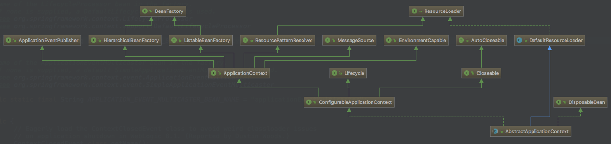
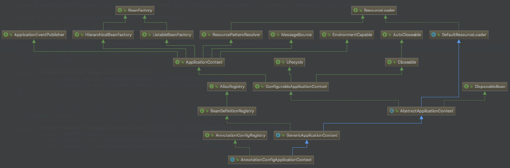
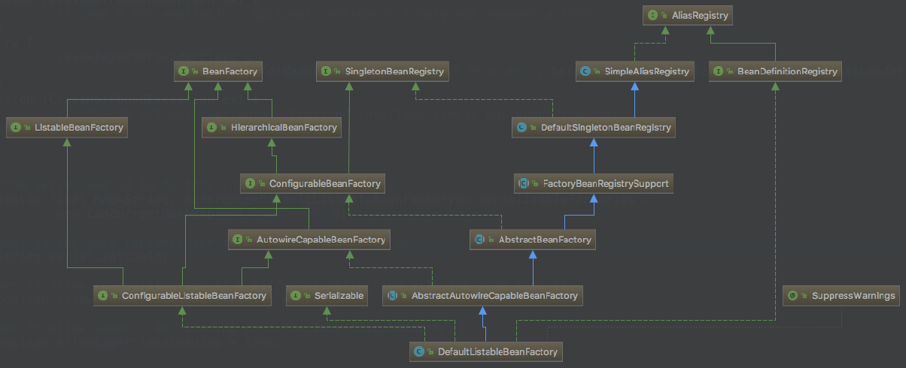

## 创建`ApplicationContext`对象

>  这边用的是`AnnotationConfigApplicationContext`

1. **AnnotationConfigApplicationContext** 继承实现结构
   - 【C】**GenericApplicationContext**
     - 【C】**AbstractApplicationContext**
       - 【C】DefaultResourceLoader
         - 【I】ResourceLoader
       - 【I】**ConfigurableApplicationContext**
         - 【I】**ApplicationContext**
           - 【I】EnvironmentCapable
           - 【I】ListableBeanFactory
           - 【I】HierarchicalBeanFactory
           - 【I】MessageSource
           - 【I】ApplicationEventPublisher
           - 【I】ResourcePatternResolver
         - 【I】Lifecycle
         - 【I】Closeable
     - 【I】BeanDefinitionRegistry
   - 【I】AnnotationConfigRegistry

### 创建`BeanFactory`

```java
public GenericApplicationContext() {
    this.beanFactory = new DefaultListableBeanFactory();
}
```

### 创建 `AnnotatedBeanDefinitionReader`对象

1. 关联`AnnotationConfigApplicationContext`

2. 往`AnnotationConfigApplicationContext`中注册 BeanDefinition 组件

   ```SQL
   org.springframework.context.annotation.internalConfigurationAnnotationProcessor
   [ConfigurationClassPostProcessor.class]
   implements BeanDefinitionRegistryPostProcessor, PriorityOrdered, 
   			ResourceLoaderAware, BeanClassLoaderAware, EnvironmentAware
   
   ---
   
   org.springframework.context.annotation.internalAutowiredAnnotationProcessor
   [AutowiredAnnotationBeanPostProcessor.class]
   implements SmartInstantiationAwareBeanPostProcessor
   
   ---
   
   org.springframework.context.annotation.internalRequiredAnnotationProcessor
   [RequiredAnnotationBeanPostProcessor.class]
   implements SmartInstantiationAwareBeanPostProcessor, MergedBeanDefinitionPostProcessor, 				PriorityOrdered, BeanFactoryAware
   
   ---
   
   org.springframework.context.annotation.internalCommonAnnotationProcessor
   [CommonAnnotationBeanPostProcessor.class]
   implements DestructionAwareBeanPostProcessor, MergedBeanDefinitionPostProcessor,
   			PriorityOrdered, Serializable,
   			InstantiationAwareBeanPostProcessor, BeanFactoryAware
   
   ---
   
   org.springframework.context.event.internalEventListenerProcessor
   [EventListenerMethodProcessor.class]
   implements SmartInitializingSingleton, ApplicationContextAware
   
   ---
   
   org.springframework.context.event.internalEventListenerFactory
   [DefaultEventListenerFactory.class]
   implements EventListenerFactory, Ordered
   ```

### 创建`ClassPathBeanDefinitionScanner`

1. 关联`AnnotationConfigApplicationContext`

### 注册配置类

> 有 `@Configuration` 注解的类

## `refresh`方法

> 在`AbstractApplicationContext`类中

### `prepareRefresh()` 

- `initPropertySources(); `ApplicationContext子类实现可以自定义自己的 PropertySources
- `getEnvironment().validateRequiredProperties();` 校验 Property
- `this.earlyApplicationEvents = new LinkedHashSet<>()`

### `obtainFreshBeanFactory()` 

> `ConfigurableListableBeanFactory beanFactory = obtainFreshBeanFactory();`

1. `refreshBeanFactory();`刷新 BeanFactory

   ```java
   this.beanFactory.setSerializationId(getId());
   ```

2. `getBeanFactory();` 返回刚才`GenericApplicationContext`创建的BeanFactory对象

### `prepareBeanFactory(beanFactory)` 

- 设置BeanFactory的类加载器、BeanExpressionResolver、PropertyEditorRegistrar

  ```Java
  beanFactory.setBeanClassLoader(getClassLoader());
  
  beanFactory.setBeanExpressionResolver(new StandardBeanExpressionResolver(beanFactory.getBeanClassLoader()));
  
  beanFactory.addPropertyEditorRegistrar(new ResourceEditorRegistrar(this, getEnvironment()));
  ```

- 添加部分BeanPostProcessor【ApplicationContextAwareProcessor】

  ``` java
  beanFactory.addBeanPostProcessor(new ApplicationContextAwareProcessor(this));
  ```

  > 该接口的作用
  >
  > ``` java
  > public Object postProcessBeforeInitialization(final Object bean, String beanName) throws BeansException {
  > 	invokeAwareInterfaces(bean);
  > 	return bean;
  > }
  > 
  > private void invokeAwareInterfaces(Object bean) {
  > 	if (bean instanceof Aware) {
  > 		if (bean instanceof EnvironmentAware) {
  > 			((EnvironmentAware) bean).setEnvironment(this.applicationContext.getEnvironment());
  > 		}
  > 		if (bean instanceof EmbeddedValueResolverAware) {
  > 			((EmbeddedValueResolverAware) bean).setEmbeddedValueResolver(this.embeddedValueResolver);
  > 		}
  > 		if (bean instanceof ResourceLoaderAware) {
  > 			((ResourceLoaderAware) bean).setResourceLoader(this.applicationContext);
  > 		}
  > 		if (bean instanceof ApplicationEventPublisherAware) {
  > 			((ApplicationEventPublisherAware) bean).setApplicationEventPublisher(this.applicationContext);
  > 		}
  > 		if (bean instanceof MessageSourceAware) {
  > 			((MessageSourceAware) bean).setMessageSource(this.applicationContext);
  > 		}
  > 		if (bean instanceof ApplicationContextAware) {
  > 			((ApplicationContextAware) bean).setApplicationContext(this.applicationContext);
  > 		}
  > 	}
  > }
  > ```

- 设置忽略的自动装配的接口。被忽略后应用上下文通常会使用其他方式解决依赖关系。例如：ApplicationContext的依赖注入会使用ApplicationContextAware来实现。默认情况下，只有BeanFactoryAware接口被忽略。

  > 被忽略的组件：`EnvironmentAware`, `EmbeddedValueResolverAware`, `ResourceLoaderAware`, `ApplicationEventPublisherAware`, `MessageSourceAware`, `ApplicationContextAware`

  ``` java
  this.ignoredDependencyInterfaces.add(ifc);
  ```

- 注册可以自动解析装配的Bean；可以直接在任何组件中使用`@Resource`等注解注入

  > 注册的bean：BeanFactory、ResourceLoader、ApplicationEventPublisher、ApplicationContext

  >Demo:
  >
  >``` java
  >@Resource
  >private ApplicationEventPublisher applicationEventPublisher;
  >```

- 添加BeanPostProcessor【ApplicationListenerDetector】

  > 负责`ApplicationContext` register 和 remove 实现`ApplicationListener`接口的bean

- 给BeanFactory中注册一些能用的组件（单例Bean）

  > ```java
  > beanFactory.registerSingleton(ENVIRONMENT_BEAN_NAME, getEnvironment());
  > ```

  - environment【ConfigurableEnvironment】
  - systemProperties【Map<String, Object>】
  - systemEnvironment【Map<String, Object>】

### `postProcessBeanFactory(beanFactory)`

> 子类自定义

### `invokeBeanFactoryPostProcessors(beanFactory)`

> BeanDefinitionRegistryPostProcessor extends BeanFactoryPostProcessor

1. 获取所有的实现 `BeanDefinitionRegistryPostProcessor`接口的实例

2. 先执行实现了`PriorityOrdered`优先级接口的`BeanDefinitionRegistryPostProcessor`的`postProcessBeanDefinitionRegistry`方法

   ```java
   postProcessor.postProcessBeanDefinitionRegistry(registry)
   ```

   > 使用AnnotationConfigApplicationContext初始化时，会有 ConfigurationClassPostProcessor满足这个条件。
   >
   > 该类是在 AnnotatedBeanDefinitionReader 创建时注入的
   >
   > key为：org.springframework.context.annotation.internalConfigurationAnnotationProcessor
   >
   > 
   >
   > 该类的作用是解析程序启动时传入的被@Configuration注解修饰的配置类。使用 ConfigurationClassParser 的parse方法解析出当前spring容器需要关心bean的BeanDefinition

3. 再执行实现了Ordered顺序接口的BeanDefinitionRegistryPostProcessor的`postProcessBeanDefinitionRegistry`方法

4. 最后执行没有实现任何优先级或者是顺序接口的BeanDefinitionRegistryPostProcessor的`postProcessBeanDefinitionRegistry`方法

5. 执行所有实现 BeanDefinitionRegistryPostProcessor 接口的 postProcessBeanFactory方法

6. 获取所有的实现BeanFactoryPostProcessor接口的实例

7. 先执行实现了PriorityOrdered优先级接口的BeanFactoryPostProcessor的方法

8. 再执行实现了Ordered顺序接口的BeanFactoryPostProcessor

9. 最后执行没有实现任何优先级或者是顺序接口的BeanFactoryPostProcessor

> `BeanFactoryPostProcessor`
>
> 在应用程序上下文的标准初始化之后修改其内部bean工厂。所有bean定义都已经加载，但是还没有实例化bean。这允许覆盖或添加属性，甚至可以初始化bean
> 
>
> `BeanDefinitionRegistryPostProcessor`
>
> 在标准初始化之后修改应用程序上下文的内部bean定义注册表。所有常规bean定义都已加载，但还没有实例化bean。这允许在下一个后期处理阶段开始之前添加进一步的bean定义

### `registerBeanPostProcessors(beanFactory)`  

#### 注册顺序

1. 获取所有实现 `BeanPostProcessor`接口的processorName
2. 按顺序向`beanFactory`中注册实现了`PriorityOrdered`接口的BeanPostProcessor
3. 按顺序向`beanFactory`中注册实现了`Ordered`接口的BeanPostProcessor
4. 向`beanFactory`中注册剩下的BeanPostProcessor
5. 按顺序向`beanFactory`重新注册实现了`MergedBeanDefinitionPostProcessor`接口的bean
6. 向`beanFactory`中重新注册`ApplicationListenerDetector`

#### BeanPostProcessor家族

---

**BeanPostProcessor继承结构**

> 【 Object postProcessBeforeInitialization(Object bean, String beanName) 】
>
> 【 Object postProcessAfterInitialization(Object bean, String beanName) 】

- **DestructionAwareBeanPostProcessor**

  > 【 void postProcessBeforeDestruction(Object bean, String beanName) 】
  >
  > 【 boolean requiresDestruction(Object bean) 】

- **InstantiationAwareBeanPostProcessor**

  > 【 Object postProcessBeforeInstantiation(Class<?> beanClass, String beanName) 】
  >
  > 【 boolean postProcessAfterInstantiation(Object bean, String beanName) 】
  >
  > 【 PropertyValues postProcessPropertyValues(PropertyValues pvs, PropertyDescriptor[] pds, Object bean, String beanName) 】

  - **SmartInstantiationAwareBeanPostProcessor**

    > 【 Class<?> predictBeanType(Class<?> beanClass, String beanName) 】
    >
    > 【 Constructor<?>[] determineCandidateConstructors(Class<?> beanClass, String beanName) 】
    >
    > 【 Object getEarlyBeanReference(Object bean, String beanName) 】

- **MergedBeanDefinitionPostProcessor**

  > 【 void postProcessMergedBeanDefinition(RootBeanDefinition beanDefinition, Class<?> beanType, String beanName) 】

---

**MergedBeanDefinitionPostProcessor**

- `postProcessMergedBeanDefinition`

  可以使用合并过的RootBeanDefinition（由父类BeanDefinition创建RootBeanDefinition，然后使用子类的BeanDefinition覆盖）做一些需要的业务。调用时机在createBeanInstance之后，在populateBean之前

**DestructionAwareBeanPostProcessor**

- `postProcessBeforeDestruction`

  bean注销时调用

- `requiresDestruction`

  在Bean创建完成后（doCreateBean方法中）调用。调用 `registerDisposableBeanIfNecessary(beanName, bean, mbd); `方法时调用，判断是否需要注册到beanFactory【DefaultListableBeanFactory】的注销列表

**InstantiationAwareBeanPostProcessor**

- `postProcessBeforeInstantiation`

  该方法是在bean创建之前被调用，是容器给的一个直接返回目标类代理对象的机会 。该方法返回null时，后面的doCreateBean方法继续执行。返回不为null时会调用 postProcessAfterInitialization后直接返回。不会再创建bean

- `postProcessAfterInstantiation`

  该方法是在Bean创建完后，但是还没有设置属性时被执行。默认返回true。如果返回false时会直接将对象返回。不会再进行属性注入的流程

- `postProcessPropertyValues`

  在bean创建之后，属性值还没有设置时调用该方法设置bean的属性值

**SmartInstantiationAwareBeanPostProcessor**

- `predictBeanType`

  用于预测目标类的类型。主要用于BeanDefinition无法确定Bean类型时

- `determineCandidateConstructors`

  确认类选择器，该方法在bean创建时调用

- `getEarlyBeanReference`

  在解决循环时会使用到。用于暴露已创建完成的，但是还没有初始化完成的Bean

### `initMessageSource()`  

> 初始化MessageSource组件（做国际化功能；消息绑定，消息解析）

1. 获取BeanFactory
2. 看容器中是否有id为messageSource的，类型是MessageSource的组件
3. 如果有赋值给messageSource，如果没有自己创建一个DelegatingMessageSource；MessageSource：取出国际化配置文件中的某个key的值；能按照区域信息获取
4. 把创建好的MessageSource注册在容器中，以后获取国际化配置文件的值的时候，可以自动注入MessageSource

### `initApplicationEventMulticaster()`  

1. 获取BeanFactory
2. 从BeanFactory中获取`ApplicationEventMulticaster`事件派发器
3. 如果上一步没有配置；创建一个`SimpleApplicationEventMulticaster`
4. 将创建的ApplicationEventMulticaster添加到BeanFactory中

###  `onRefresh()`

> 子类重写，提供扩展

### `registerListeners()`  

1. 从容器中拿到所有的`ApplicationListener`
2. 将每个监听器bean名称添加到事件派发器中
3. 派发`beanFactory`中的`earlyApplicationEvents`列表中的事件

### `finishBeanFactoryInitialization(beanFactory)`

#### 流程1

> 执行方法： `DefaultListableBeanFactory # preInstantiateSingletons`

- 获取容器中的所有Bean，依次进行初始化。可以被初始化的bean需要符合以下条件

  ```java
  !bd.isAbstract() && bd.isSingleton() && !bd.isLazyInit()
  ```

- 所有符合条件的bean创建完成后，依次执行实现了`SmartInitializingSingleton`接口的`afterSingletonsInstantiated`方法

  ``` java
  for (String beanName : beanNames) {
  	Object singletonInstance = getSingleton(beanName);
  	if (singletonInstance instanceof SmartInitializingSingleton) {
  		smartSingleton.afterSingletonsInstantiated();
  	}
  }
  ```

#### 流程2

> 获取容器中的所有Bean，依次进行初始化。
>
> 执行方法：`AbstractBeanFactory#doGetBean`

1. 先获取缓存中保存的单实例Bean。如果能获取到说明这个Bean之前被创建过（所有创建过的单实例Bean都会被缓存起来）

2. check如果有父容器并且该容器没有加载bean的定义。则使用父容器加载bean

   ```java
   parentBeanFactory != null && !containsBeanDefinition(beanName)
   ```

3. 获取Bean的定义信息

   ``` java
   final RootBeanDefinition mbd = getMergedLocalBeanDefinition(beanName)
   ```

4. 获取当前Bean依赖的其他Bean;如果有按照getBean()把依赖的Bean先创建出来；【dependsOn注解】

   ``` java
   String[] dependsOn = mbd.getDependsOn();
   if (dependsOn != null) {
   	for (String dep : dependsOn) {
   		registerDependentBean(dep, beanName);
   		getBean(dep);
   	}
   }
   ```

5. 判断是singleton还是prototype还是其他。已下为singleton的流程

#### 流程3

> 执行方法：AbstractAutowireCapableBeanFactory#createBean

1. 使用 `InstantiationAwareBeanPostProcessor` 可以直接返回bean，无需走后续的创建流程，只走 `postProcessAfterInitialization` 即可

   ``` java
   // Give BeanPostProcessors a chance to return a proxy instead of the target bean instance.
   Object bean = resolveBeforeInstantiation(beanName, mbdToUse);
   if (bean != null) {
   	return bean;
   }
   
   ---
   
   bean = applyBeanPostProcessorsBeforeInstantiation(targetType, beanName);
   if (bean != null) {
   	bean = applyBeanPostProcessorsAfterInitialization(bean, beanName);
   }
   ```

2. 创建bean

   ```Java
   Object beanInstance = doCreateBean(beanName, mbdToUse, args);
   ```

#### 流程4

> 执行方法：AbstractAutowireCapableBeanFactory#doCreateBean

1. 清理cache、 创建bean。创建方式：使用工厂、反射等。还可以使用 `SmartInstantiationAwareBeanPostProcessor` 返回的构造器创建。出现方法的重写时还会使用CGLIB反射创建

   ```java
   BeanWrapper instanceWrapper = null;
   if (mbd.isSingleton()) {
   	instanceWrapper = this.factoryBeanInstanceCache.remove(beanName);
   }
   if (instanceWrapper == null) {
   	instanceWrapper = createBeanInstance(beanName, mbd, args);
   }
   ```

2. 允许使用 `MergedBeanDefinitionPostProcessor`对 BeanDefinition 进行修改

   ``` java
   // Allow post-processors to modify the merged bean definition.
   if (!mbd.postProcessed) {
       applyMergedBeanDefinitionPostProcessors(mbd, beanType, beanName);
       mbd.postProcessed = true;
   }
   ```

3. 解决可能因为循环引用出现的问题

   ``` java
   if (earlySingletonExposure) {
   	addSingletonFactory(beanName, () -> getEarlyBeanReference(beanName, mbd, bean));
   }
   
   protected Object getEarlyBeanReference(String beanName, RootBeanDefinition mbd, Object bean) {
   	Object exposedObject = bean;
   	for (BeanPostProcessor bp : getBeanPostProcessors()) {
   		if (bp instanceof SmartInstantiationAwareBeanPostProcessor) {
   			exposedObject = bp.getEarlyBeanReference(exposedObject, beanName);
   		}
   	}
   	return exposedObject;
   }
   ```

4. populateBean bean【见流程5】

5. initialize bean【见流程6】

6. 将创建完成的bean注册到 BeanFactory

#### 流程5

> 执行方法：AbstractAutowireCapableBeanFactory#populateBean

1. 判断是不是要跳过字段初始化的流程

   ```java
   for (BeanPostProcessor bp : getInstantiationAwareBeanPostProcessors()) {
   	if (!ibp.postProcessAfterInstantiation(bw.getWrappedInstance(), beanName)) {
   		continueWithPropertyPopulation = false;
   		break;
   	}
   }
   
   if (!continueWithPropertyPopulation) {
   	return;
   }
   ```

2. 处理autowireByName、autowireByType不过现在一般都不推荐使用了

3. 可以尝试修改 PropertyValues、设置bean的属性

   > 1. `CommonAnnotationBeanPostProcessor`（提供对Resource、PostConstruct、PreDestroy注解的支持）
   > 2. `AutowiredAnnotationBeanPostProcessor`（提供对Autowired、Value注解的支持）
   > 3. `RequiredAnnotationBeanPostProcessor`（提供对Required注解的支持）
   >
   > 这三个BeanPostProcessor依次完成了bean的依赖注入、属性解析等功能

   ``` java
   for (BeanPostProcessor bp : getInstantiationAwareBeanPostProcessors()) {
   	pvs = bp.postProcessPropertyValues(pvs, filteredPds, bw.getWrappedInstance(), beanName);
   	if (pvs == null) {
   		return;
   	}
   }
   ```

4. 设置属性值，不过这个操作只对配置文件中定义的bean起作用。注解注入bean的属性设置在<3>中几个BeanPostProcessor中完成

#### 流程6

> 执行方法：AbstractAutowireCapableBeanFactory#initializeBean

1. 调用aware方法

   ``` java
   invokeAwareMethods(beanName, bean);
   
   private void invokeAwareMethods(final String beanName, final Object bean) {
   	if (bean instanceof BeanNameAware) {
   		((BeanNameAware) bean).setBeanName(beanName);
   	}
   	if (bean instanceof BeanClassLoaderAware) {
   		ClassLoader bcl = getBeanClassLoader();
   		if (bcl != null) {
   			((BeanClassLoaderAware) bean).setBeanClassLoader(bcl);
   		}
   	}
   	if (bean instanceof BeanFactoryAware) {
   		((BeanFactoryAware) bean).setBeanFactory(AbstractAutowireCapableBeanFactory.this);
   	}
   }
   ```

2. 执行BeanPostProcessor的前置方法

   ``` java
   for (BeanPostProcessor beanProcessor : getBeanPostProcessors()) {
   	Object current = beanProcessor.postProcessBeforeInitialization(result, beanName);
   	if (current == null) {
   		return result;
   	}
   }
   ```

3. 执行init方法

   ``` java
   if (bean instanceof InitializingBean) {
   
   	((InitializingBean) bean).afterPropertiesSet();
   }
   ```

4. 执行BeanPostProcessor的后置方法

   ``` java
   for (BeanPostProcessor beanProcessor : getBeanPostProcessors()) {
   	Object current = beanProcessor.postProcessAfterInitialization(result, beanName);
   	if (current == null) {
   		return result;
   	}
   }
   ```

### `finishRefresh()`

``` java
protected void finishRefresh() {
	// Clear context-level resource caches (such as ASM metadata from scanning).
	clearResourceCaches();

	// Initialize lifecycle processor for this context.
	initLifecycleProcessor();

	// Propagate refresh to lifecycle processor first.
	getLifecycleProcessor().onRefresh();

	// Publish the final event.
	publishEvent(new ContextRefreshedEvent(this));

	// Participate in LiveBeansView MBean, if active.
	LiveBeansView.registerApplicationContext(this);
}
```
## 结构图





