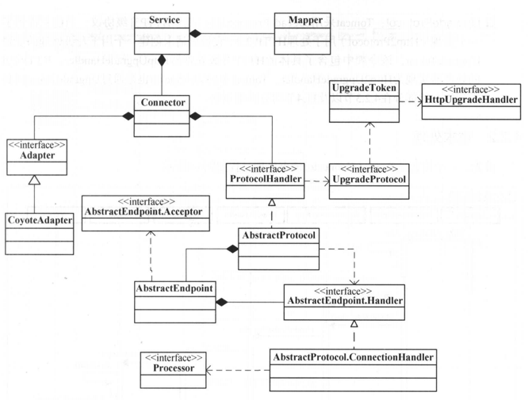

## Connector生命周期

> Connectior 继承了 LifecycleMBeanBase，它的生命周期受Lifecycle接口影响

### 组件

### Connector init()

#### 调用时机

​	Catalina调用Server的init()方法，Server调用Service的init()方法。Service的init()方法中调用Connector的init()方法

#### 做了什么

 	1. 创建 CoyoteAdapter 建立 ProtocolHandler 与 CoyoteAdapter 的关联关系
 	2. 调用 ProtocolHandler 的 init() 方法。正常情况下 ProtocolHandler 的实现类是 Http11NioProtocol
     - 设置 endpoint 的 name、domain等信息
     - 调用 endpoint（NioEndpoint） 的 init() 方法
       - 创建 ServerSocketChannel
       - 设置 ServerSocketChannel 的socket参数
         - **socket.setReceiveBufferSize**：设置内部套接字接收缓冲区的大小，并告知远程客户端TCP交互时设置的滑动窗口是多少
         - **socket.setPerformancePreferences**：通过配置连接时间、延迟、带宽三个整数值的大小，来实现当前应用对这三者的权衡。以此提高ServerSocket的性能。
         - **socket.setReuseAddress**：设置是否重用，连接已经关闭但是处于超时状态的连接
         - **socket.setSoTimeout**：设置连接超时时间，默认为20000即20s
       - ServerSocketChannel 绑定 ip地址和端口号，并且设置backlog值为100。该值的作用是设置TCP全连接队列的长度为100，即 accept queue 队列长度为100，并且应用线程还没有从accept queue队列里取值时就会丢弃客户端连接请求（这种情况很少出现）
       - ServerSocketChannel 设置为阻塞方式
       - acceptor 线程默认为 1， poller线程默认为 2
       - 初始化SSL
       - 调用 NioSelectorPool  的 open方法
         - 使用 Selector.open() 创建共享Selector
         - 创建 NioBlockingSelector 对象并关联 Shared Selector ，然后调用 NioBlockingSelector 的open() 方法
           - 创建 BlockPoller（继承Thread） 对象并关联 Shared Selector 
           - 将 BlockPoller 设置为守护线程
           - 设置 BlockPoller 名称
           - 调用  BlockPoller 的 start() 方法，运行 BlockPoller 线程

### Connector start()

#### 调用时机

​	Service的start时，启动Engine、Executor、mapperListener之后。调用 Connector 的 start() 方法。

#### 做了什么

1. 调用 ProtocolHandler 的 start() 方法
   1. 调用 NioEndpoint 的 start() 方法
      - 创建 processorCache、eventCache、nioChannels 三个同步栈（SynchronizedStack）
      - 创建线程池。corePoolSize（10）、maximumPoolSize（200）、keepAliveTime（60s）、workQueue（TaskQueue）、threadFactory（TaskThreadFactory）、handler（RejectHandler 直接抛 RejectedExecutionException 异常）
      - 初始化共享锁LimitLatch用于限制Endpoint处理连接的并发量，默认值10000
      - 创建  Poller（实现Runnable接口） 数组，默认为2个，分别调用其 start() 方法
      - 创建 Acceptor 数组，循环创建并启动Acceptor。默认为1个
   2. 创建并启动 AsyncTimeout（实现Runnable接口）

