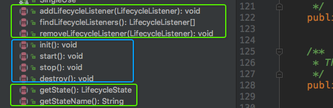
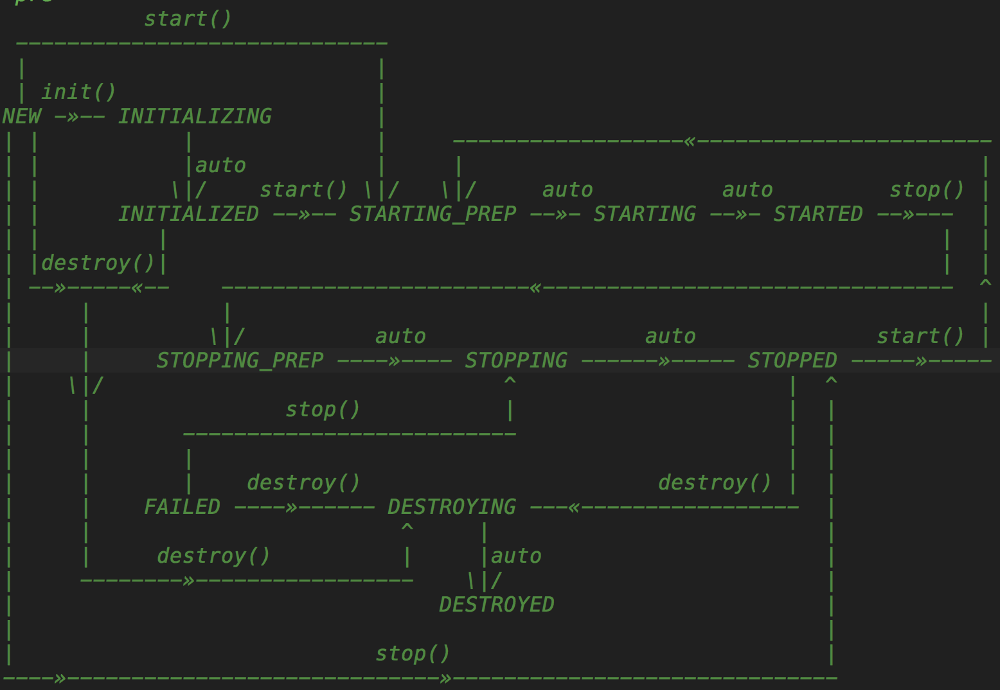

# Lifecycle


## 接口定义



1. 三个操作Listener的接口，分别是添加、删除、获取全部
2. 四个生命周期方法，init、start、stop、destroy
3. 两个获取state的方法，获取state、和state的name

## LifecycleBase对接口的实现


1. LifecycleBase有4个方法操作Listener。添加、删除、获取所有和遍历依次调用lifecycleEvent方法。
2. 对应Lifecycle接口的4个生命周期方法，base里有8个方法，分别是自己实现的负责生命周期控制的init、start、stop、destroy和与其相对的提供给子类实现具体业务逻辑的initInternal、startInternal、stopInternal、destroyInternal四个抽象方法。
3. 之后是获取和设置state的方法

##### init()

```Java
public final synchronized void init() throws LifecycleException {
    
    //init 必须是NEW状态开始的
    if (!state.equals(LifecycleState.NEW)) {
        invalidTransition(Lifecycle.BEFORE_INIT_EVENT);
    }

    try {
        // 将状态设置成初始化进行。。。
        setStateInternal(LifecycleState.INITIALIZING, null, false);
        // 子类实现自己的业务
        initInternal();
        // 设置初始化状态为down
        setStateInternal(LifecycleState.INITIALIZED, null, false);
    } catch (Throwable t) {
       
    }
}
```

##### start()

```Java
public final synchronized void start() throws LifecycleException {

    // start()之前不能调用start()
    if (LifecycleState.STARTING_PREP.equals(state) || LifecycleState.STARTING.equals(state) ||
        LifecycleState.STARTED.equals(state)) {
        return;
    }

    // 之前如未init()，需先执行init方法
    if (state.equals(LifecycleState.NEW)) {
        init();
    } else if (state.equals(LifecycleState.FAILED)) {
        // 异常状态stop()
        stop();
    } else if (!state.equals(LifecycleState.INITIALIZED) &&
               !state.equals(LifecycleState.STOPPED)) {
        // 1. 初始化完成 2.stop完成   有且仅有这两种情况可以执行start()
        invalidTransition(Lifecycle.BEFORE_START_EVENT);
    }

    try {
        // 设置状态为预开始
        setStateInternal(LifecycleState.STARTING_PREP, null, false);
        // 子类实现自己的业务
        startInternal();
        // 启动失败stop
        if (state.equals(LifecycleState.FAILED)) {
            stop();
        } else if (!state.equals(LifecycleState.STARTING)) {
           // 子类中必须将状态切至开始中，否则将抛异常
            invalidTransition(Lifecycle.AFTER_START_EVENT);
        } else {
            // 将starting切至started，start完成
            setStateInternal(LifecycleState.STARTED, null, false);
        }
    } catch (Throwable t) {
       
    }
}
```

##### stop()

``` java
public final synchronized void stop() throws LifecycleException {

    // 预开始、结束中、已结束这三个状态就无需stop了
    if (LifecycleState.STOPPING_PREP.equals(state) || LifecycleState.STOPPING.equals(state) ||
        LifecycleState.STOPPED.equals(state)) {

        return;
    }

    if (state.equals(LifecycleState.NEW)) {
        state = LifecycleState.STOPPED;
        return;
    }

    // 只有开始完成、和失败状态可以执行stop操作
    if (!state.equals(LifecycleState.STARTED) && !state.equals(LifecycleState.FAILED)) {
        invalidTransition(Lifecycle.BEFORE_STOP_EVENT);
    }

    try {
        if (state.equals(LifecycleState.FAILED)) {
            // 失败事件通知
            fireLifecycleEvent(BEFORE_STOP_EVENT, null);
        } else {
            setStateInternal(LifecycleState.STOPPING_PREP, null, false);
        }

        // 子类处理业务
        stopInternal();

        // 子类需将状态切至 1.停止中 2.失败 两个状态后续流程才会执行
        if (!state.equals(LifecycleState.STOPPING) && !state.equals(LifecycleState.FAILED)) {
            invalidTransition(Lifecycle.AFTER_STOP_EVENT);
        }

        setStateInternal(LifecycleState.STOPPED, null, false);
    } catch (Throwable t) {
 
    } finally {
        if (this instanceof Lifecycle.SingleUse) {
          // 执行destroy方法
            setStateInternal(LifecycleState.STOPPED, null, false);
            destroy();
        }
    }
}
```

##### destroy()

```java
public final synchronized void destroy() throws LifecycleException {
    //如果失败状态、先执行停止操作
    if (LifecycleState.FAILED.equals(state)) {
        stop();
    }

    // 销毁中和已销毁无需再调用该方法
    if (LifecycleState.DESTROYING.equals(state) ||
        LifecycleState.DESTROYED.equals(state)) {
        return;
    }

    // 必须是1.已停止 2.失败 3.未初始化 4. 初始化结束四种状态才能执行destroy方法 
    if (!state.equals(LifecycleState.STOPPED) &&
        !state.equals(LifecycleState.FAILED) &&
        !state.equals(LifecycleState.NEW) &&
        !state.equals(LifecycleState.INITIALIZED)) {
        invalidTransition(Lifecycle.BEFORE_DESTROY_EVENT);
    }

    try {
        // 设置正在销毁
        setStateInternal(LifecycleState.DESTROYING, null, false);
        // 子类逻辑处理
        destroyInternal();
        //已销毁
        setStateInternal(LifecycleState.DESTROYED, null, false);
    } catch (Throwable t) {

    }
}
```


## 规则定义

