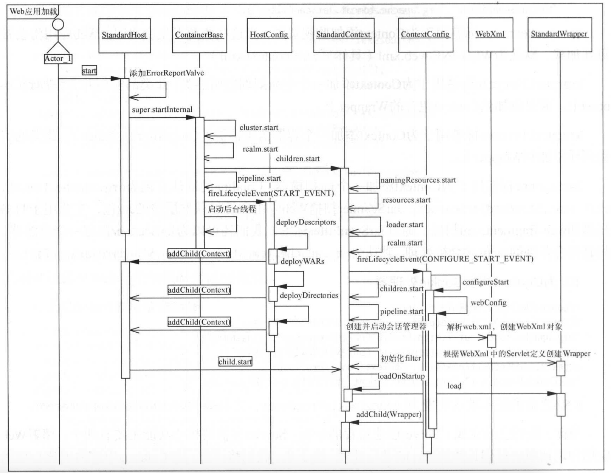
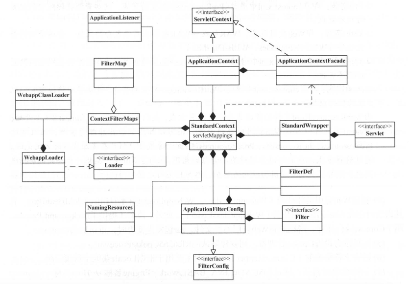

## Digester装配组件

### 解析Server

1. 创建Server实例
2. 创建全局J2EE企业命名上下文（JNDI）
3. 为Server添加生命周期监听器
   - **AprLifecycleListener**：在Server初始化后加载APR库，Server停止后销毁
   - **VersionLoggerListener**：Server初始化之前打印操作系统、JVM及服务器版本信息
   - **JreMemoryLeakPreventionListener**：Server初始化之前调用，解决单例对象创建导致的JVM内存泄漏及锁未见问题
   - **GlobalResourcesLifecycleListener**：Server启动时将JNDI资源注册为MBean进行管理
   - **ThreadLocalLeakPreventionListener**：Context停止时重建Executor池中的线程，避免导致内存泄漏
4. 创建Service实例
5. 为Service添加生命周期监听器（Catalina默认未指定）
6. 为Service创建Executor，Catalina共享Executor的级别是Service，默认未指定
7. 为Service创建Connector组件
8. 为Connector添加虚拟主机SSL配置
9. 为Connector添加生命周期监听器，默认Catalina未指定Connector的监听器
10. 为Connector添加升级协议，用于支持HTTP/2
11. 添加子元素解析规则

### 解析Engine

1. 创建Engine实例，并设置到Service中。创建Engine时添加EngineConfig用于打印Engine启动和停止日志
2. 为Engine添加集群配置
3. 为Engine添加生命周期监听器，默认情况下Catalina未指定
4. 为Engine添加安全配置

### 解析Host

1. 创建Host设置到Engine中，**创建时设置HostConfig生命周期监听器**
2. 为Host添加集群
3. 为Host添加生命周期管理器，默认Catalina未添加
4. 为Host添加安全配置
   - **AccessLogValve**：记录访问日志

### 解析Context

> 一般无需在server.xml中配置Context。HostConfig会扫描部署Context

1. Context实例化，通过server.xml配置部署的Context参数create为true，需要创建实例。通过HostConfig扫描部署的Context，create参数为false只需解析子节点即可。Context创建时会关联一个ContextConfig用于读取web.xml等
2. 为Context添加生命周期监听器
3. 为Context指定类加载器
4. 为Context添加会话管理
5. 为Context添加初始化参数
6. 为Context添加安全配置及web资源配置
7. 为Context添加资源链接（ContextResourceLink），用于J2EE命名服务
8. 为Context添加Valve
9. 为Context添加守护资源配置
   - **WatchedResource**：为Context添加监视资源，监视资源变更时web应用会被重新加载，默认为WEB-INF/web.xml
   - **WrapperLifecycle**：为Context添加一个容器监听器类（ContainerListener）
   - **JarScanner**：为Context添加一个jar扫描器（StandardJarScanner），用于扫描web应用和类加载器层级的jar，可添加JarScanFilter只过滤加载感兴趣的jar
10. 为Context添加Cookie处理器

## Web应用加载

##StandardHost启动详情

1. StandardEngin调用ContainerBase中的startInternal()使用线程池来调用StandardHost的start()方法初始化实例
2. StandardHost在调用super的startInternal之前，会先创建一个ErrorReportValve放到pipeline中，该valve的作用是当web.xml不配置错误处理时，该Valve会统一处理错误请求
3. StandardHost调用super的startInternal方法时，会发布start事件。HostConfig实现了LifecycleListener接口，会监听这个事件完成StandardContext的自动加载

## HostConfig详解

> HostConfig实现了LifecycleListener接口，会注册监听器到StandardHost实例中。HostConfig关心PERIODIC_EVENT、BEFORE_START_EVENT、START_EVENT、STOP_EVENT这四个事件

### START_EVENT

> start_event事件具体不是context，部署context的方式分为三种context描述文件部署、web目录部署、war包部署

#### Context描述文件部署

1. 扫描host配置文件的基础目录（$CATALINA_BASE/conf/<Engine名称>/<Host名称>），使用线程池解析该路径下的所有配置文件
2. 每个文件的部署线程操作如下：
   - 使用Digester创建Context实例
   - 更新Context实例的名称、路径
   - 为Context添加ContextConfig生命周期监听器
   - 调用Host的addChild，将Context实例添加到Host，如果host已启动则还会启动Context
   - 将Context描述文件、Web应用目录、web.xml等添加到守护资源，资源变更时会重新加载和部署web应用

#### web目录部署

1. 该种方式会在Host的appBase目录下找到所有符合条件（不符合deployIgnore、目录名不是META-INF和WEB-INF）的目录，使用线程池完成部署
2. 如果deployXML为true并且存在  META-INF/context.xml文件，会使用Digester解析context.xml创建Context实例，如果copyXML为true，则会将描述文件拷贝到$CATALINA_BASE/conf/<Engine名称>/<Host名称>目录下。deployXML为false但是存在META-INF/context.xml的话就会报错
3. 其他步骤与Context描述文件部署相同

#### war包部署

1. 与web目标相比多了war包解压缩的功能，其他流程大致相符

### PERIODIC_EVENT

1. periodic event事件在守护线程执行完成后触发
2. 守护线程开启在ContainerBase中，一般只有StandardEngine维护
3. HostConfig实例维护着redeployResources、reloadResources两个列表。当守护资源发生变更时通过这两个列表来判断是需要重新加载还是重新部署。重新加载是只需要重启原来的Context实例就好，比如修改了web.xml时候，重新部署则是创建新的Context，比如改变了Context配置的时候

## StandardContext讲解

### Context组成

1. ApplicationContext供Tomcat服务器使用，Web请求处理中使用到的是ApplicationContextFacade
2. FilterConfig实现类为ApplicationFilterConfig，该类也负责创建Filter实例化
3. FilterMap保存配置的filter-mapping
4. NamingResources用于存储Web应用声明的命名服务（JNDI）
5. servletMapping维护servlt-mapping的配置信息

### Context启动流程

1. 初始化当前Context使用的WebResourceRoot并启动。WebResourceRoot维护了Web应用所有的资源合集（Class文件、jar文件、其他资源文件。主要用于类加载和按照路径查找资源文件）
2. 创建WebappLoader，该类在start时会创建实际加载Context的WebappClassLoader
3. 创建Cookie处理器
4. 设置字符集映射
5. 初始化临时目录：$CATALINA_BASE/conf/<Engine名称>/<Host名称>/<Context名称>
6. 发布CONFIGURE_START_EVENT事件，ContextConfig监听该事件完成Servlet的创建
7. 启动Context子节点（Wrapper）
8. 启动Pipeline
9. 创建SessionManager
10. 将WebResourceRoot添加到ServletContext，注册名称为：org.apache.catalina.resources
11. 创建InstanceManager，之后用于创建Servlet、Filter等
12. 创建JarScanner添加到ServletContext中，注册名为：org.apache.tomcat.JarScanner
13. 实例化应用监听器
    - 
14. 启动会话管理器
15. 实例化FilterConfig（ApplicationFilterConfig）、Filter、并初始化filter
16. 调用 loadOnStartup >=0 Wrapper的load方法，实例化Servlet
17. 判断是否启动后台线程监控资源文件的变更，如果不启动则遵守父容器的调度

### ContextConfig详解

> ContextConfig与HostConfig一样也实现了LifecycleListener接口。它关心context状态变更时的CONFIGURE_START_EVENT、CONFIGURE_STOP_EVENT、BEFORE_START_EVENT、AFTER_START_EVENT、AFTER_INIT_EVENT、AFTER_DESTROY_EVENT这六个事件

#### AFTER_INIT_EVENT

context属性配置

#### BEFORE_START_EVENT

更新context的docbase属性和解决web目录锁

#### CONFIGURE_START_EVENT

1. 解析web.xml、创建Wrapper、Filter、ServletContextListener等web容器相关对象
2. 除了解析web.xml外还会解析Tomcat默认配置、web-fragment.xml（jar包中的web.xml的片段）、ServletContainerInitializer。并对解析结果进行排序

