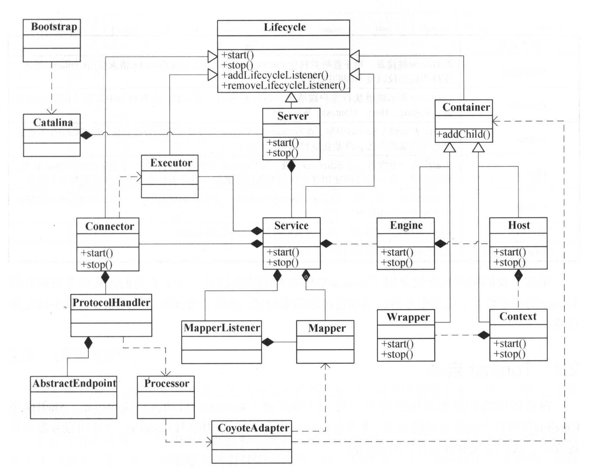
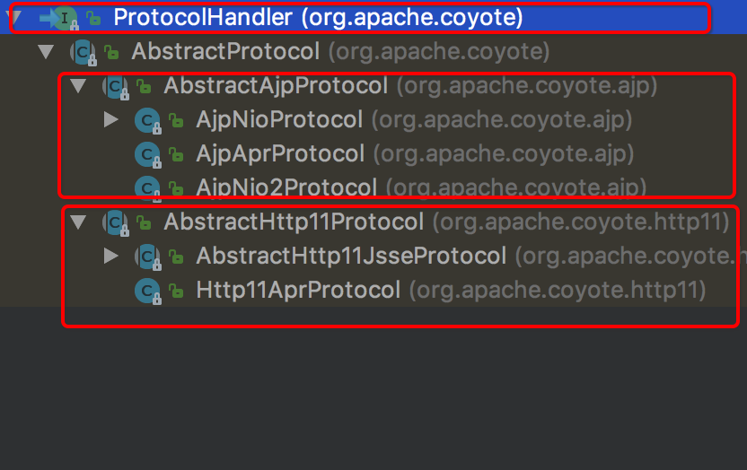
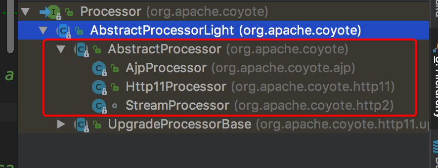
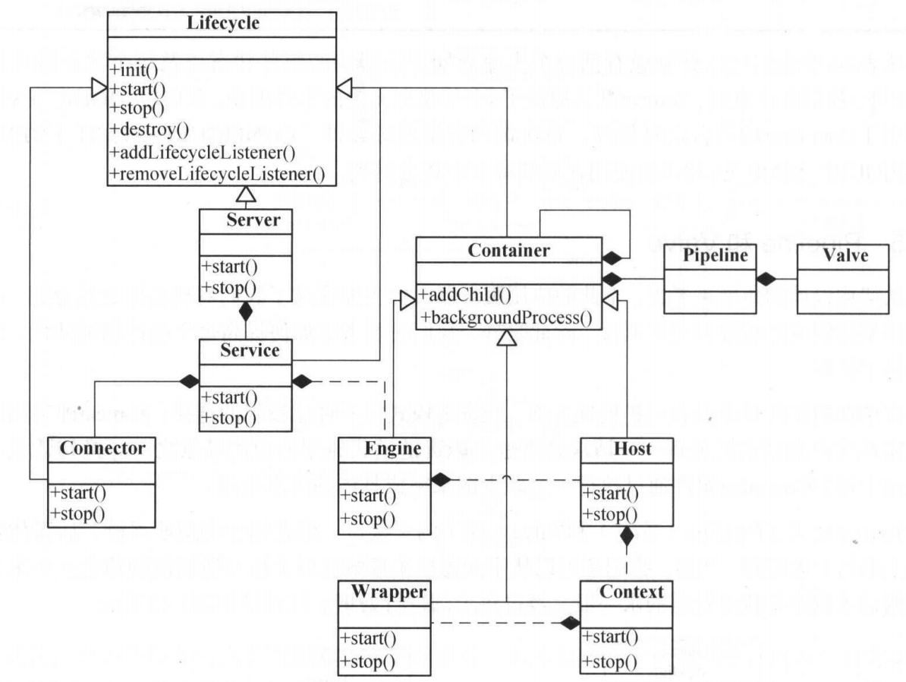
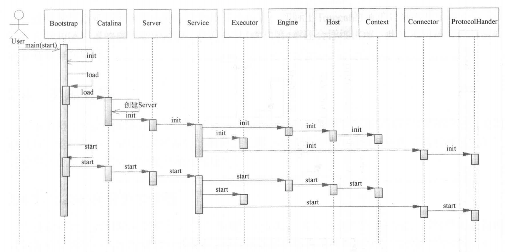
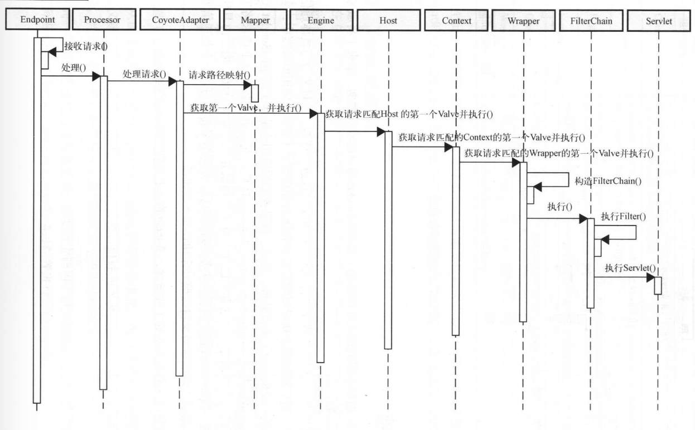

## Tomcat整体架构

1. Connector、Executor、Server、Service、Container（Engine、Host、Context、Wrapper）都实现了生命周期Lifecycle接口。生命周期活动遵从Lifecycle定义的规则
2. Tomcat在Bootstrap类中通过反射启动Catalina容器。Catalina启动Server进而启动Service。
3. Service是整个Tomcat的核心。它聚合了Executor、Connector、MapperListener、Mapper、Engine等组件

## Connector实现

1. Connecotr使用ProtocolHandler来处理连接请求。ProtocolHandler有不同协议的处理实现，Tomcat默认支持的AJP和http两种协议

2. ProtocolHandler使用Endpoint和Processor来实现具体的功能。Endpoint负责接收客户端发来的请求，processor解析协议名，并匹配响应的协议解析器解析请求

   

3. processor获取适配器（CoyoteAdapter）使用具体的处理引擎处理请求

4. CoyoteAdapter拿到Service中维护的mapper对象来使用具体的容器处理请求。MapperListener监听容器的状态变更，以此调整mapper的映射关系

## Container处理具体请求

1. Engine、Host、Context、Wrapper都是继承了Container。他们都是容器
2. 每一个容器都维护了一个Pipeline列表。
3. Pipeline中维护了一个Basic Valve和First Valve。basic Valve是单独设置的。添加Valve，first Valve不存在时first指针指向加入的Valve。当first Valve存在时会遍历到链表的最后一个节点（最后这个节点执行basic Valve）让最后一个节点指向新加入的节点，新加入的节点再指向basic Valve
4. 父容器的basic Valve会调用子容器的first Valve

## Tomcat启动

## Tomcat请求处理

