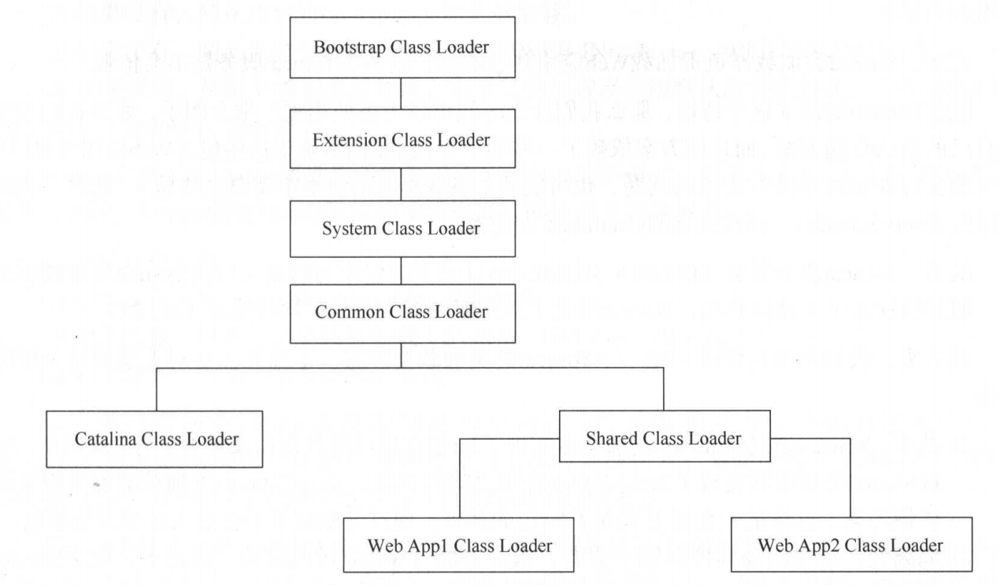

## Tomcat与jvm类加载器

1. **Bootstrap Class Loader**：加载`%JAVA_HOME%/jre/lib` 目录下的，支持JVM运行的核心类
2. **Extension Class Loader**：加载`%JAVA_HOME%/jre/lib/ext`目录下的，扩展类
3. **System Class Loader** ：加载应用程序jar包及启动入口类
4. **Common Class Loader**：Tomcat顶层公用类加载器，路径由`common.loader`指定
5. **Catalina Class Loader**：加载Tomcat服务器运行依赖相关类库，路径由`server.loader`指定
6. **Shared Class Loader**：所有web应用的父加载器，路径由`shared.loader`指定

## 设计的好处

1. **隔离性**：web应用于服务器运行环境的隔离，web应用之间的隔离
2. **灵活性**：可以单独重启某个应用
3. **性能**：不加载多余的类文件

## 加载顺序

#### java类加载顺序

1. 从缓存中加载
2. 如果缓存中没有，使用父类加载器加载
3. 如果父类加载器没有，从自己累加载器加载
4. 如果没有，则抛出异常

#### Tomcat类加载顺序

1. 从缓存中加载
2. 如果没有，从Bootstrap Class Loader加载器加载
3. 如果没有，从当前类加载器加载（WEB-INF/classes、WEB-INF/lib）的顺序
4. 如果没有从父类加载器加载

> Tomcat 提供delegate参数。该参数默认为fasle，加载顺序如上，当delegate为true时，当前类加载时机将落后于父类加载器

