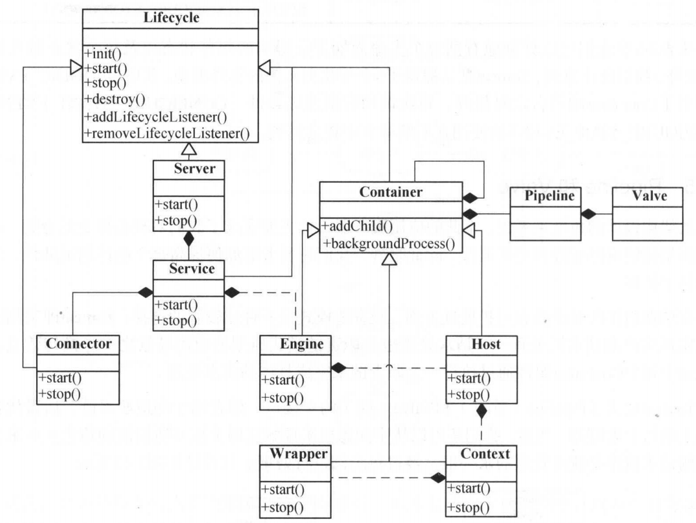

## Tomcat整体架构

1. Connector、Executor、Server、Service、Container（Engine、Host、Context、Wrapper）都实现了生命周期Lifecycle接口。生命周期活动遵从Lifecycle定义的规则
2. Service是整个Tomcat的核心。它聚合了Executor、Connector、MapperListener、Mapper、Engine等组件
3. ProtocalHandler主要有两个组件EndPoint负责接收客户端请求，Processor负责根据具体协议解析请求
4. Server 1----* service  1----1 engine  1----*  host  1----*  context

## Container组件

1. Engine、Host、Context、Wrapper都是继承了Container。他们都是容器
2. 每一个容器都维护了一个Pipeline列表。
3. Pipeline中维护了一个Basic Valve和First Valve。basic Valve是单独设置的。添加Valve，first Valve不存在时first指针指向加入的Valve。当first Valve存在时会遍历到链表的最后一个节点（最后这个节点执行basic Valve）让最后一个节点指向新加入的节点，新加入的节点再指向basic Valve
4. 父容器的basic Valve会调用子容器的first Valve

## Tomcat启动

1. Bootstrap 中 main() 方法作为组件启动的入口

2. Bootstrap.init()

   - 创建 Common Class Loader。创建方式是拿到一个集成了所有jar包URL的数组，然后`new URLClassLoader(array)`
   - 以Common Class Loader作为父级，创建Server Class Loader
   - 以Common Class Loader作为父级，创建Shared Class Loader

   > 默认情况下由于 catalina.properties 中没有 server.loader、shared.loader 的相关配置，所以Server、Shared两个Class Loader 是并没有真去创建的，两个Class Loader 都复用了Common Class Loader
   >
   > 
   >
   > Common、Server、Shared 三个类加载器的定义分别针对：容器和应用共同依赖的jar，如servlet-api、容器自身依赖的jar、所有容器共享的jar，如所有容器都用spring相关jar，就可以放在这里
   >
   > 
   >
   > 这样做的意义主要是：
   >
   > 共享：共同依赖的jar只加载一次
   >
   > 隔离：应用中不需要关心容器相关的类文件

3. 使用上一步创建的Class Loader 加载Catalina类文件，创建Catalina对象，调用对象的方法设置类加载器

4. 调用Catalina的load方法使用Digester创建Server，调用Server的init方法。

   > Server.init()
   >
   > Service.init()
   >
   > - Executor.init()
   > - Connector.init()、ProtocalHandler.init()
   > - Engine.init()、Host.init()、Context.init()

5. 调用Catalina的start方法，进而调用Server的start方法

   >Server.start()
   >
   >Service.start()
   >
   >- Executor.start()
   >- Connector.start()、ProtocalHandler.start()
   >- Engine.start()、Host.start()、Context.start()

## Tomcat请求处理

1. Endpoint接收请求的Socket
2. Processor根据具体协议解析从Socket中解析出请求内容
3. 请求通过CoyoteAdapter适配到具体的Engine。（适配手段是使用请求路径查看Mapper。组件发生变化时MapperListener会改变Mapper的状态）
4. 流量依次流经Engine、Host、Context、Wrapper。具体都是首先获取组件中Pipeline的第一个Valve。之后依次调用，到最后一个Valve时调用下一个组件
5. 创建FilterChain，执行FilterChain
6. 执行Servlet

