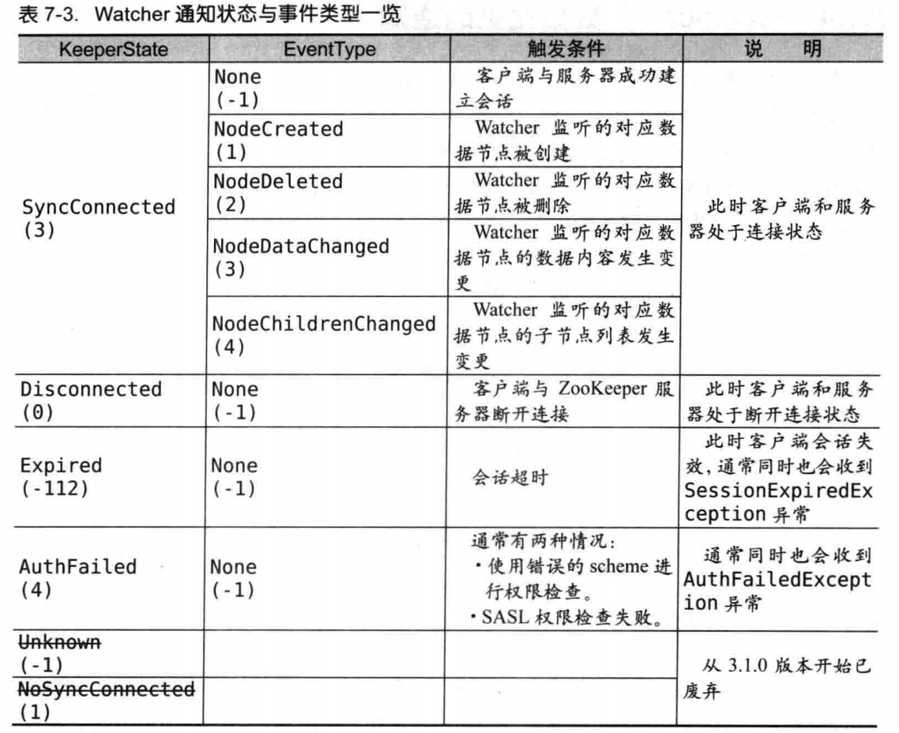

## Watcher通知状态与事件

## ACL（访问控制列表）

> 可以从三个方面了解ACL，`scheme:id:permission`即权限模式、授权对象、权限

### 权限模式：Scheme

- **IP**：针对ip这个维度进行权限控制。ps:`ip:192.168.1.23`、`ip:192.168.0.1/24`
- **Digest**：类似于`username:password`这种形式进行权限控制
- **World**：所有客户端都可访问，无权限控制
- **Super**：super用户可操作zk中任意数据结构

### 授权对象：ID

> 权限赋予的用户或指定实体，不同的权限模式下授权的对象也是不同的

### 权限：Permission

- **CREATE**：允许在授权节点下创建子节点
- **DELETE**：允许删除授权节点
- **READ**：允许访问授权节点并读取授权内容和子节点列表
- **WRITE**：允许对授权节点进行更新操作
- **ADMIN**：允许对授权节点进行ACL相关变更操作

## 客户端

### 组成

- **Zookeeper实例**：客户端入口
- **ClientWatchManager**：客户端Watcher管理器
- **HostProvider**：客户端地址列表管理器
- **ClientCnxn**：客户端核心线程。包括SendThread（负责网络通信）和EventThread（负责服务器端事件的处理）。

> 1. 设置Watcher
> 2. 设置zk服务器地址列表
> 3. 创建ClientCnxn

### 一次会话的创建

#### 初始化阶段

- 初始化zk对象，同时会创建一个Watcher管理器（ClientWatchManager）
- 设置会话默认Watcher。客户端创建时传入的Watcher会保存在ClientWatchManager中
- 构建zk服务器地址列表管理器
- 创建并初始化ClientCnxn。这时会创建两个队列outgingQueue、pendingQueue分别负责请求的发送和接收
- 初始化SendThread、EventThread

#### 会话创建阶段

- 启动SendThread、EventThread
- 随机获取一个服务器地址
- 创建TCP长连接，这里只是完成了网络的互联，并不代表客户端成功连如了zk服务器
- 构造发送ConnectRequest请求
- 从outgoingQueue队列中拿到请求并发送

#### 响应处理阶段

- 接收服务端请求。如果客户端状态不是“已初始化”，接到的第一个请求会作为会话创建请求处理
- 处理response。解析会话请求，获取sessionId
- 连接成功。更新客户端状态，通知HostProvider
- 回调客户端初始化成功的事件

