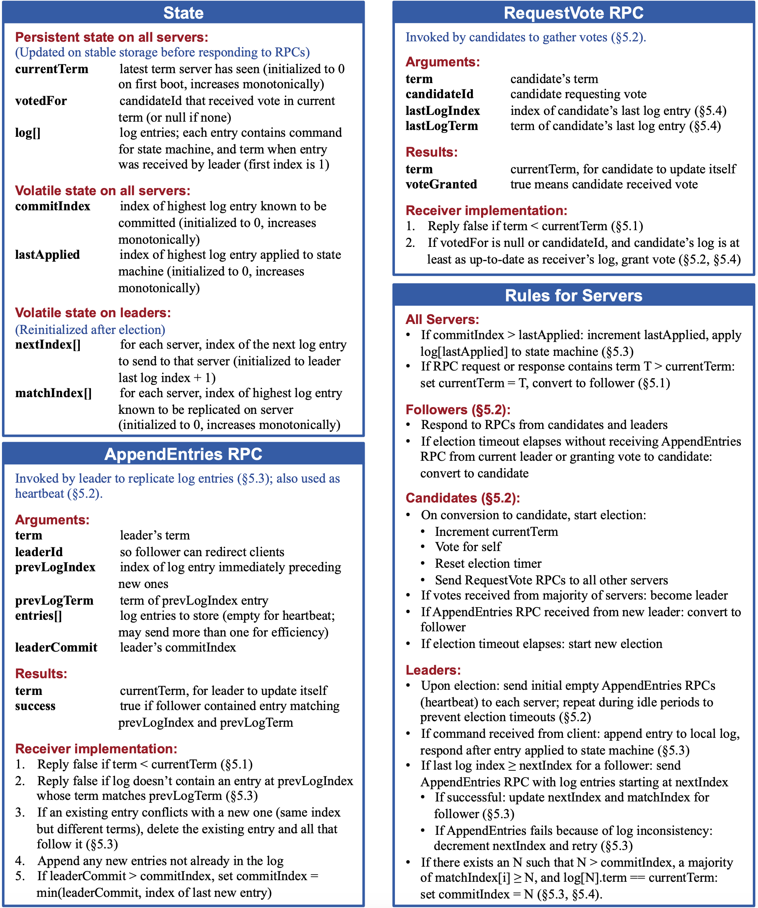
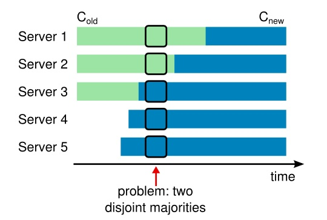

### Raft是什么

- Raft 是⼀种为了管理复制⽇志的⼀致性算法

### Raft提出的特性

- **强领导者**：和其他⼀致性算法相⽐， Raft 使⽤⼀种更强的领导能⼒形式。⽐如，⽇志条⽬只从领导者发送给其他的服务器。这种⽅式简化了对复制⽇志的管理并且使得 Raft 算法更加易于理解
- **领导选举**： Raft 算法使⽤⼀个随机计时器来选举领导者。这种⽅式只是在任何⼀致性算法
  都必须实现的⼼跳机制上增加了⼀点机制。在解决冲突的时候会更加简单快捷
- **成员关系调整**： Raft 使⽤⼀种共同⼀致的⽅法来处理集群成员变换的问题，在这种⽅法下，处于调整过程中的两种不同的配置集群中⼤多数机器会有重叠，这就使得集群在成员变换的时候依然可以继续⼯作

### 复制状态机

> **复制状态机** 通常是基于复制⽇志实现，是实现容错服务的一种常规方法，复制状态机在分布式系统中被⽤于解决很多容错的问题

- 每⼀个服务器存储⼀个包含⼀系列指令的⽇志，并且按照⽇志的顺序进⾏执⾏
- 每⼀个⽇志都按照相同的顺序包含相同的指令，所以每⼀个服务器都执⾏相同的指令序列
- 因为每个状态机都是确定的，每⼀次执⾏操作都产⽣相同的状态和同样的序列

### ⼀致性算法

> ⼀致性算法的⼯作是保证复制⽇志相同

- 在⼀台服务器上，⼀致性模块接收客户端发送来的指令然后增加到⾃⼰的⽇志中去
- 它和其他服务器上的⼀致性模块进⾏通信来保证每⼀个服务器上的⽇志最终都以相同的顺序包含相同的请求
- ⼀旦指令被正确的复制，每⼀个服务器的状态机按照⽇志顺序处理他们

**实际系统中使⽤的⼀致性算法通常含有以下特性**

- 安全性保证（绝对不会返回⼀个错误的结果）：包括⽹络延迟、分区、丢包、冗余和乱序等错误都可以保证正确
- 可⽤性：集群中只要有⼤多数的机器可运⾏并且能够相互通信、和客户端通信，就可以保证可⽤
- 不依赖时序来保证⼀致性：物理时钟错误或者极端的消息延迟有可能会导致可⽤性问题

### Raft分解

> **通过领导⼈的⽅式， Raft 将⼀致性问题分解成了三个相对独⽴的⼦问题**

- 领导选举：⼀个新的领导⼈需要被选举出来，当现存的领导⼈宕机的时候
- ⽇志复制：领导⼈必须从客户端接收⽇志然后复制到集群中的其他节点，并且强制要求其他节点的⽇志保持和⾃⼰相同
- 安全性：如果有任何的服务器节点已经应⽤了⼀个确定的⽇志条⽬到它的状态机中，那么其他服务器节点不能在同⼀个⽇志索引位置应⽤⼀个不同的指令

#### 领导⼈选举

#### ⽇志复制

#### 安全性

**raft特性：**

- 选举安全特性：对于⼀个给定的任期号，最多只会有⼀个领导⼈被选举出来
- 领导⼈只附加原则：领导⼈绝对不会删除或者覆盖⾃⼰的⽇志，只会增加
- ⽇志匹配原则：如果两个⽇志在相同的索引位置的⽇志条⽬的任期号相同，那么我们就认为这个⽇志从头到这个索引位置之间全部完全相同
- 领导⼈完全特性：如果某个⽇志条⽬在某个任期号中已经被提交，那么这个条⽬必然出现在更⼤任期号的所有领导⼈中
- 状态机安全特性：如果⼀个领导⼈已经将给定的索引值位置的⽇志条⽬应⽤到状态机中，那么其他任何的服务器在这个索引位置不会提交⼀个不同的⽇志

服务器节点都处于这三个状态之⼀：领导⼈、跟随者或者候选⼈

在通常情况下，系统中只有⼀个领导⼈并且其他的节点全部都是跟随者

跟随者都是被动的：他们不会发送任何请求，只是简单的响应来⾃领导者或者候选⼈的请求

领导⼈处理所有的客户端请求（如果⼀个客户端和跟随者联系，那么跟随者会把请求重定向给领导⼈）

