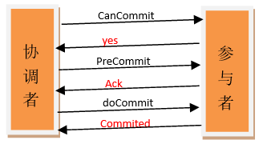

#### 什么是分布式系统

​	分布式系统是一个**硬件或者软件**组件**分布在不同的网络计算机上**，**彼此之间仅仅通过消息传递**进行**通信和协调**的系统

#### CAP理论

> 一个分布式系统，不可能同时满足一致性（Consistency）、可用性（Availability）和分区容错性（Partition tolerance）这三个基本需求，最多只能同时满足其中两项

##### 一致性

​	数据在多个副本之间是否能够保持一致的特性。

##### 可用性

​	对于每一个操作请求，总是可以在**有限的时间**内**返回正常的结果**

##### 分区容错性

​	分布式系统在遇到任何网络分区故障的时候，仍然需要能够保证对外提供满足一致性和可用性的服务，除非是整个网络环境都发生了故障

#### CAP定理应用

​	放弃P就代表是将所有的数据都放在一个分布式节点上，这样可以避免节点间通信问题。但是也就意味着放弃了系统的可扩展性

​	一般情况是在保留P的前提下，对A和C（最终一致性）进行权衡

#### BASE理论

> 可用（Basically Available）、软状态（ Soft State）、最终一致性（ Eventual Consistency）

​	BASE是对CAP中一致性和可用性权衡的结果。其核心思想是及时无法做到强一致性，每个应用可以根据自身的业务特点，采用适当的方式来做到最终一致性

#### 二阶段提交

​	所谓的两个阶段是指：第一阶段：**准备阶段**(投票阶段)和第二阶段：**提交阶段**（执行阶段）

##### 准备阶段

> 事务协调者(事务管理器)给每个参与者(资源管理器)发送Prepare消息，每个参与者要么直接返回失败(如权限验证失败)，要么在本地执行事务，写本地的redo和undo日志，但不提交，到达一种“万事俱备，只欠东风”的状态

1. 协调者节点向所有参与者节点询问是否可以执行提交操作(vote)，并开始等待各参与者节点的响应
2. 参与者节点执行询问发起为止的所有事务操作，并将Undo信息和Redo信息写入日志。（注意：若成功这里其实每个参与者已经执行了事务操作）
3. 各参与者节点响应协调者节点发起的询问。如果参与者节点的事务操作实际执行成功，则它返回一个”同意”消息；如果参与者节点的事务操作实际执行失败，则它返回一个”中止”消息


##### 提交阶段

> 如果协调者收到了参与者的失败消息或者超时，直接给每个参与者发送回滚(Rollback)消息；否则，发送提交(Commit)消息；参与者根据协调者的指令执行提交或者回滚操作，释放所有事务处理过程中使用的锁资源。(注意:必须在最后阶段释放锁资源)

1. 协调者节点向所有参与者节点发出”正式提交(commit)”的请求
2. 参与者节点正式完成操作，并释放在整个事务期间内占用的资源
3. 参与者节点向协调者节点发送”完成”消息
4. 协调者节点受到所有参与者节点反馈的”完成”消息后，完成事务

##### 二阶段提交的缺点

1. **同步阻塞问题**：执行过程中，所有参与节点都是事务阻塞型的。当参与者占有公共资源时，其他第三方节点访问公共资源不得不处于阻塞状态
2. **单点故障**：由于协调者的重要性，一旦协调者发生故障。参与者会一直阻塞下去。尤其在第二阶段，协调者发生故障，那么所有的参与者还都处于锁定事务资源的状态中，而无法继续完成事务操作。（如果是协调者挂掉，可以重新选举一个协调者，但是无法解决因为协调者宕机导致的参与者处于阻塞状态的问题）
3. **数据不一致**：在二阶段提交的阶段二中，当协调者向参与者发送commit请求之后，发生了局部网络异常或者在发送commit请求过程中协调者发生了故障，这回导致只有一部分参与者接受到了commit请求。而在这部分参与者接到commit请求之后就会执行commit操作。但是其他部分未接到commit请求的机器则无法执行事务提交。于是整个分布式系统便出现了数据部一致性的现象
4. **二阶段无法解决的问题**：协调者再发出commit消息之后宕机，而唯一接收到这条消息的参与者同时也宕机了。那么即使协调者通过选举协议产生了新的协调者，这条事务的状态也是不确定的，没人知道事务是否被已经提交

#### 三阶段提交

> 三阶段提交在原二阶段提交只有协调者有超时机制的基础上，引入参与者超时机制。也就是说同时在协调者和参与者中都引入超时机制



##### CanCommit阶段

1. **事务询问**：协调者向参与者发送CanCommit请求。询问是否可以执行事务提交操作。然后开始等待参与者的响应
2. **响应反馈**：参与者接到CanCommit请求之后，正常情况下，如果其自身认为可以顺利执行事务，则返回Yes响应，并进入预备状态。否则反馈No

##### PreCommit阶段

1. **发送预提交请求**：协调者向参与者发送PreCommit请求，并进入Prepared阶段
2. **事务预提交**：参与者接收到PreCommit请求后，会执行事务操作，并将undo和redo信息记录到事务日志中
3. **响应反馈**：如果参与者成功的执行了事务操作，则返回ACK响应，同时开始等待最终指令

##### doCommit阶段

1. **发送提交请求**：协调接收到参与者发送的ACK响应，那么他将从预提交状态进入到提交状态。并向所有参与者发送doCommit请求
2. **事务提交**：参与者接收到doCommit请求之后，执行正式的事务提交。并在完成事务提交之后释放所有事务资源
3. **响应反馈**：事务提交完之后，向协调者发送ACK响应
4. **完成事务**：协调者接收到所有参与者的ACK响应之后，完成事务

> 在doCommit阶段，如果参与者无法及时接收到来自协调者的doCommit或者rebort请求时，会在等待超时之后，会继续进行事务的提交

> ```
> 当进入第三阶段时，说明参与者在第二阶段已经收到了PreCommit请求，那么协调者产生PreCommit请求的前提条件是他在第二阶段开始之前，收到所有参与者的CanCommit响应都是Yes。（一旦参与者收到了PreCommit，意味他知道大家其实都同意修改了）所以，一句话概括就是，当进入第三阶段时，由于网络超时等原因，虽然参与者没有收到commit或者abort响应，但是他有理由相信：成功提交的几率很大
> ```

#### ZK

> zk的设计目标是将那些复杂并且容易出错的分布式一致性服务封装起来，构成一个高效可靠的原语集，并以一系列简单易用的接口提供给用户使用。它是一个典型的分布式数据一致性的解决方案。

##### 特点

- **顺序一致性**：从同一个客户端上发起的有序事务请求，都会有序的应用到zk上
- **原子性**：一个ZK服务器的事务请求结果，在集群中应用情况一定是一致的
- **单一视图**：无论客户端连接的是ZK的哪一台机器，其看到的服务器数据模型都是一致的
- **可靠性**：一旦一个事务成功响应给了客户端，那么这个事务引起的变化会始终保留
- **实时性**：ZK仅仅保证在一定的时间段内，客户端一定能从服务器端读取到数据的最新状态
- **高性能**：满足高并发需要
- **高可用**：解决分布式系统的单点问题
- **顺序访问控制**：实现复杂同步原语

##### 目标

- **简单的数据模型**：由一系列ZNode节点组成的树形结构，ZK将全量数据存储在内存中
- **可以构建集群**：每台机器都会在内存中维护当前集群的状态，只要集群中存在半数以上的机器能够正常工作，那么整个集群就可以正常的对外提供服务
- **顺序访问**：来自客户端的每个更新请求，ZK都会分配一个全局唯一的递增编号，这个编号反映了所有事务执行的先后顺序
- **高性能**：内存存储，slaver参与处理非事务请求（读请求）

##### 基本概念

- **集群角色**：

  - **Leader**：集群中所有机器通过Leader选举，选出一台Leader机器。Leader服务为客户端提供读、写服务
  - **Follower**：提供读服务，可以参与Leader选举，参与写操作的“过半写成功”策略
  - **Observer**：提供读服务，**不**可以参与Leader选举，**不**参与写操作的“过半写成功”策略

- **会话（Session）**：

  ​	客户端和服务端会话的建立是靠TCP长连接。第一次建立连接开始，会话就已经开始了。可以通过这个长连接完成心跳检测、请求的发送与相应、接收Watch事件等。当服务器压力太大、网络故障等因素导致连接断开时，只要在sessionTimeout规定的时间内连接到集群中任意一台服务器时，之前创建的会话仍然有效。

- **数据节点（ZNode）**：

  ​	ZK的内存存储模型是一棵树，树上的每一个节点都是一个ZNode。每个ZNode都会保存自己的数据内容，同时还会保存一系列属性信息。

  ​	ZK中ZNode可以分为持久节点与临时节点。持久节点只有在客户端主动删除的情况下才会消失。临时节点与客户端的会话绑定，一旦一个会话结束，与该会话绑定的所有临时节点都会消失

  ​	ZK允许在ZNode节点上添加 SEQUENTIAL，一旦添加该属性，在该节点在创建的时候，节点名称会添加一个由父节点来维护的自增序列号

  Stat对象属性状态：

  - **czxid**：create zxid，该节点被创建时的事务id
  - **mzxid**：modified zxid，该节点最后一次被更改时的事务id
  - **ctime**：create time，节点被创建的时间
  - **mtime**：modified time，节点最后被修改的时间
  - **version**：数据节点的版本号
  - **cversion**：子节点的版本号
  - **aversion**：节点的ACL版本号
  - **ephemeralOwner**：创建该临时节点的会话的sessionId，如果该节点为持久节点，那么该值为0
  - **dataLength**：数据内容的长度
  - **numChildren**：当前节点的子节点个数
  - **pzxid**：该节点的子节点列表最后一次被修改时的事务id。只有子节点列表变更了才会变更pzxid。子节点内容变更不会影响pzxid

- **版本**：

  ​	每个ZNode，ZK都会为其维护一个Stat的结构。Stat中记录了当前ZNode的三个版本信息

  - **version**：当前ZNode版本
  - **cversion**：当前ZNode子节点的版本
  - **aversion**：当前ZNode的ACL版本

- **Watcher（事件监听器）**：

  ​	ZK允许客户端在指定ZNode上注册一些Watcher，当一些特定事件触发的时候，ZK会将事件通知到所有感兴趣的客户端

- **ACL（Access Control Lists）**：

  ​	该策略负责权限控制，类似于UNIX文件系统的权限控制，ZK定义了以下5中权限

  - **CREATE**：创建子节点的权限
  - **READ**：获取节点数据与子节点列表的权限
  - **WRITE**：更新节点数据的权限
  - **DELETE**：删除子节点的权限
  - **ADMIN**：设置节点ACL的权限

#### ZAB协议（ZooKeeper Atomic Broadcast）

>  Zookeeper原子消息广播协议

**ZAB包括崩溃恢复和消息广播两种模式，当Leader崩溃或网络出问题时会从消息广播模式切至崩溃恢复模式**

##### 消息广播模式

​	**ZK使用单一节点（Leader）处理事务**

1. Follower收到的事务变更请求都会转发给Leader（也包括Leader自己接收的事务请求）
2. Leader收到事务请求后会生成提案下发至各个Follower（Leader会为每一个Follower分配一个FIFO队列）
3. Follower会以事务日志的形式将变更内容写入到磁盘中去，然后回复ACK
4. 集群中超过半数的Follower回复ACK后，Leader就会在该节点上将事务提交，并发送Commit，将状态变更通知给各个Follower

	 ​	ZAB中涉及到的二阶段提交与真正的二阶段提交不同之处就在于，ZAB中移除了中断逻辑，Follower要么响应Leader事务请求，要么不响应。当集群中超过半数的Follower响应后Leader就认为事务可以提交了

##### 崩溃恢复模式

1. Leader选举
   - 因为要保证在Leader和部分Follower上提交的事务最终要被所有的服务器都提交，还要保证丢弃只在Leader上提交的事务。所以参与选举的Leader服务器，要拥有所有服务器中最高的已提交事务的ZXID
   - Leader选举过程~
2. 数据同步
   - 新选举出的Leader服务器会要求建联的所有Follower服务器更新至与其相同的事务版本
   - 数据同步完成之后才会对外提供服务
   - 新加入的机器会同步Leader服务器的数据信息，同步完成后才可对外提供服务

> ZXID：事务版本号，全局单调递增的唯一性ID。一共64位，每次的Leader选举成功后都会从磁盘中获取最大的ZXID，高32位版本计作epoch自增1。低32位就是事务的自增ID

